# 边缘侧 MQTT · 逐页讲稿（入门版）

对应新版 15 页 PPT。约 15–20 分钟；建议时间包含停顿与指图。口述内容为主讲，原理与答疑供准备。

## 目录

- [第 01 页 · 边缘侧 MQTT 通信入门](#s1)

- [第 02 页 · 边缘侧连接业务后端与 PLC](#s2)

- [第 03 页 · 六个入口看懂通信主线](#s3)

- [第 04 页 · MQTT 按主题发布与订阅](#s4)

- [第 05 页 · 五个 Topic 分清数据方向](#s5)

- [第 06 页 · 连接后订阅命令与毫米波主题](#s6)

- [第 07 页 · 配置先看地址、身份与投递等级](#s7)

- [第 08 页 · 命令下行经过接收、排队与处理](#s8)

- [第 09 页 · 一条命令包含 ID、Cmd 和 Value](#s9)

- [第 10 页 · PLC 状态整理后发布到 STATE](#s10)

- [第 11 页 · RETURN 与心跳回答不同问题](#s11)

- [第 12 页 · 三个基础功能支撑消息流转](#s12)

- [第 13 页 · 收到消息不等于设备完成动作](#s13)

- [第 14 页 · 排查按连接、主题、处理、回传顺序](#s14)

- [第 15 页 · 记住两条方向、五个主题、三层结果](#s15)

## 第 01 页 · 边缘侧 MQTT 通信入门

建议 45 秒。

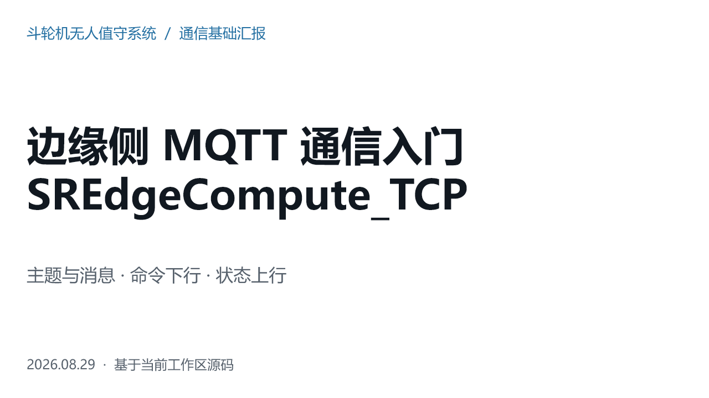

### 口述讲稿

今天主要介绍边缘侧的 MQTT 通信，以及理解通信链路所需的几个基础功能。我们围绕三个问题展开：边缘程序在系统中做什么，消息怎样从后端到达边缘程序，设备状态又怎样返回。后面会用一条走行命令串起整个过程。这里讲的是源码里的实现，不是现场设备的验收结果；复杂的堆取料策略和 PLC 字节协议不在这次展开。

### 为什么

- 先建立消息流向，再看类名和方法，能避免把文件清单背下来却不知道它们如何合作。

- MQTT 只负责通信的一部分；边缘侧还要把业务数据转换成 PLC 能理解的数据。

### 可能追问

**问：这次和原版有什么区别？**

原版覆盖完整源码与复杂控制；本版把主线收窄到 MQTT，加上配置、队列、状态映射和周期控制等基础知识。

### 过渡

先确定边缘程序在整个系统中的位置。

源码与协议依据

- S01：`Edge/SREdgeCompute_TCP/SREdgeCompute_TCP/Program.cs:28  [static void Main]`
- S03：`Edge/SREdgeCompute_TCP/SREdgeCompute_TCP/Client/MqttClient.cs:29  [public async Task PublishMessage]`
- S10：`Edge/SREdgeCompute_TCP/SREdgeCompute_TCP/Service/EdgeToPlcService.cs:30  [public EdgeToPlcService]`
- S11：`Edge/SREdgeCompute_TCP/SREdgeCompute_TCP/Service/PlcToEdgeService.cs:34  [private void CatchData]`

## 第 02 页 · 边缘侧连接业务后端与 PLC

建议 75 秒。

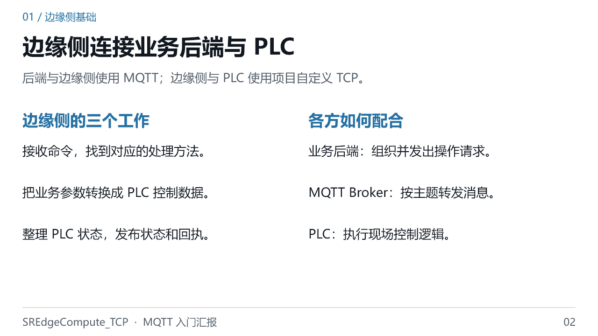

### 口述讲稿

可以把边缘程序理解成连接业务系统和设备控制系统的适配层。后端发来的是“要做什么”，例如给出一个走行目标；边缘程序根据命令名称找到处理方法，并组织 PLC 所需的数据。反过来，PLC 返回的是设备状态，边缘程序把它整理成业务对象，再通过 MQTT 发出去。要特别注意：这套项目不是用 MQTT 直接控制 PLC，MQTT 到边缘程序为止，边缘到 PLC 走的是自定义 TCP 通信。

### 为什么

- 协议不同、数据含义不同，需要一个适配层。业务 JSON 不能直接当作 PLC 报文发送。

- Broker 负责消息路由，不负责替项目解释走行目标，也不负责执行机械动作。

### 可能追问

**问：边缘侧就是 MQTT Broker 吗？**

不是。边缘程序是 MQTT 客户端，既订阅命令，也发布状态；Broker 是接收并转发这些消息的服务。

### 过渡

知道它的角色后，用六个入口定位相关代码。

源码与协议依据

- S03：`Edge/SREdgeCompute_TCP/SREdgeCompute_TCP/Client/MqttClient.cs:29  [public async Task PublishMessage]`
- S04：`Edge/SREdgeCompute_TCP/SREdgeCompute_TCP/Client/TCPClient.cs:95  [private async Task ReceiveStream]`
- S08：`Edge/SREdgeCompute_TCP/SREdgeCompute_TCP/Service/CommandService.cs:104  [public async Task DistributeCommand]`
- S10：`Edge/SREdgeCompute_TCP/SREdgeCompute_TCP/Service/EdgeToPlcService.cs:30  [public EdgeToPlcService]`
- S11：`Edge/SREdgeCompute_TCP/SREdgeCompute_TCP/Service/PlcToEdgeService.cs:34  [private void CatchData]`

## 第 03 页 · 六个入口看懂通信主线

建议 65 秒。

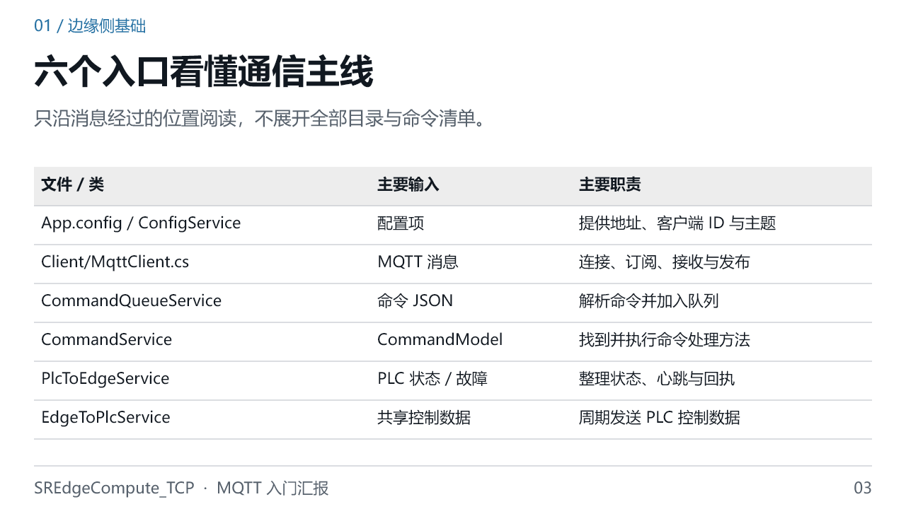

### 口述讲稿

这一页不要求记住所有目录，只要知道遇到问题去哪里找。连接地址和主题先看 App.config，由 ConfigService 读取。真正封装 MQTT 的是 Client 目录下的 MqttClient。接收命令之后，CommandQueueService 解析并入队，后台消费服务再调用 CommandService 分发。上行看 PlcToEdgeService，它把 PLC 数据变成状态对象。周期控制则看 EdgeToPlcService。文件名中 To 的方向很直观：谁到谁，就表示数据流向。

### 为什么

- 通信封装与业务处理分开，阅读时可以先确定消息收到了没有，再追踪它被怎样处理。

- 表中是六个阅读入口，不是项目只有六个文件；后台消费还涉及 CommandQueueBackgroundService，命令查找涉及 CommandRegistry。

### 可能追问

**问：从哪个文件开始最容易？**

先看配置和 MqttClient，再沿 MessageReceived 事件进入队列，最后看一条具体命令；上行单独从 PlcToEdgeService.CatchData 开始。

### 过渡

接下来先用最少的概念解释 MQTT。

源码与协议依据

- S02：`Edge/SREdgeCompute_TCP/SREdgeCompute_TCP/App.config:1`
- S03：`Edge/SREdgeCompute_TCP/SREdgeCompute_TCP/Client/MqttClient.cs:29  [public async Task PublishMessage]`
- S05：`Edge/SREdgeCompute_TCP/SREdgeCompute_TCP/Service/CommandQueueService.cs:30  [private void EnqueueCommand]`
- S06：`Edge/SREdgeCompute_TCP/SREdgeCompute_TCP/Service/CommandQueueBackgroundService.cs:15  [protected override async Task ExecuteAsync]`
- S07：`Edge/SREdgeCompute_TCP/SREdgeCompute_TCP/Infrastructure/Commands/CommandRegistry.cs:35  [public int ScanAndRegister]`
- S08：`Edge/SREdgeCompute_TCP/SREdgeCompute_TCP/Service/CommandService.cs:104  [public async Task DistributeCommand]`
- S10：`Edge/SREdgeCompute_TCP/SREdgeCompute_TCP/Service/EdgeToPlcService.cs:30  [public EdgeToPlcService]`
- S11：`Edge/SREdgeCompute_TCP/SREdgeCompute_TCP/Service/PlcToEdgeService.cs:34  [private void CatchData]`

## 第 04 页 · MQTT 按主题发布与订阅

建议 85 秒。

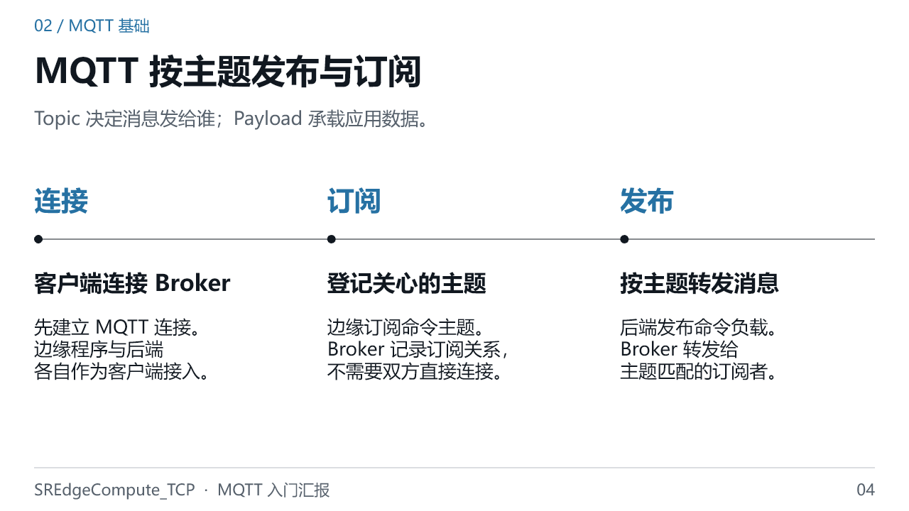

### 口述讲稿

MQTT 的核心是发布订阅。客户端先连接 Broker，再订阅自己关心的主题。发布者把一条消息交给 Broker，里面包含主题和负载，Broker 根据订阅关系转发。主题可以理解为消息分类，例如命令和状态分别使用不同主题；负载才是实际业务内容。MQTT 本身不规定负载必须是 JSON，JSON 是这个项目使用的格式。一台客户端可以同时承担发布者和订阅者：边缘侧订阅命令，同时又发布设备状态。

### 为什么

- 发送者不用逐个维护接收者地址，而是面向主题发送，这减少了双方的直接依赖。

- Topic 不是文件路径，也不是 HTTP 接口；名称看起来有斜杠，是因为 MQTT 用它划分主题层级。

### 可能追问

**问：是不是只要连上 Broker 就能收到所有消息？**

不是。正常业务消息需要有匹配的订阅关系，并且部署中的访问权限也要允许。连接成功不等于所有主题都订阅成功。

### 过渡

把这些概念对应到项目的五个实际主题。

源码与协议依据

- W01：[OASIS MQTT 3.1.1 标准 §3.1–3.3、§3.8、§4.3、§4.7](https://docs.oasis-open.org/mqtt/mqtt/v3.1.1/os/mqtt-v3.1.1-os.html)
- S03：`Edge/SREdgeCompute_TCP/SREdgeCompute_TCP/Client/MqttClient.cs:29  [public async Task PublishMessage]`

## 第 05 页 · 五个 Topic 分清数据方向

建议 90 秒。

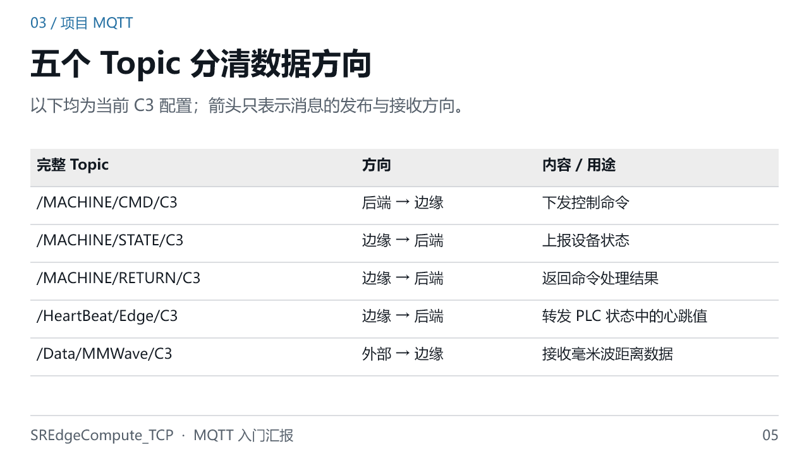

### 口述讲稿

这五个主题可以分为两组。边缘侧订阅的是 CMD 和毫米波数据；边缘侧发布的是 STATE、RETURN 和 HeartBeat。CMD 表示希望设备做什么，STATE 表示设备当前是什么状态，RETURN 表示某条命令的处理结果，HeartBeat 用来观察状态链路是否仍在到达。最后一个毫米波主题属于外部数据输入，接收后直接更新相关控制数据，不走普通命令队列。当前源码能确认接收路径，外部发布者的具体实现没有在目标代码中找到。

### 为什么

- 把命令、状态、回执分开，消费者可以按用途订阅，不必在同一种消息里猜测含义。

- C3 是当前设备标识的一部分，主题字符串还包含开头的斜杠与大小写；这些都必须匹配，不能随意省略。

### 可能追问

**问：边缘需要先订阅 STATE 才能发布 STATE 吗？**

不需要。发布与订阅是独立操作；边缘可以发布状态，而只订阅命令和毫米波主题。

### 过渡

这些订阅在程序启动时如何建立？

源码与协议依据

- S02：`Edge/SREdgeCompute_TCP/SREdgeCompute_TCP/App.config:1`
- S03：`Edge/SREdgeCompute_TCP/SREdgeCompute_TCP/Client/MqttClient.cs:29  [public async Task PublishMessage]`
- S05：`Edge/SREdgeCompute_TCP/SREdgeCompute_TCP/Service/CommandQueueService.cs:30  [private void EnqueueCommand]`
- S15：`Edge/SREdgeCompute_TCP/SREdgeCompute_TCP/Service/CommandService.cs:186  [public async Task SetMMWData]`
- W01：[OASIS MQTT 3.1.1 标准 §3.1–3.3、§3.8、§4.3、§4.7](https://docs.oasis-open.org/mqtt/mqtt/v3.1.1/os/mqtt-v3.1.1-os.html)

## 第 06 页 · 连接后订阅命令与毫米波主题

建议 85 秒。

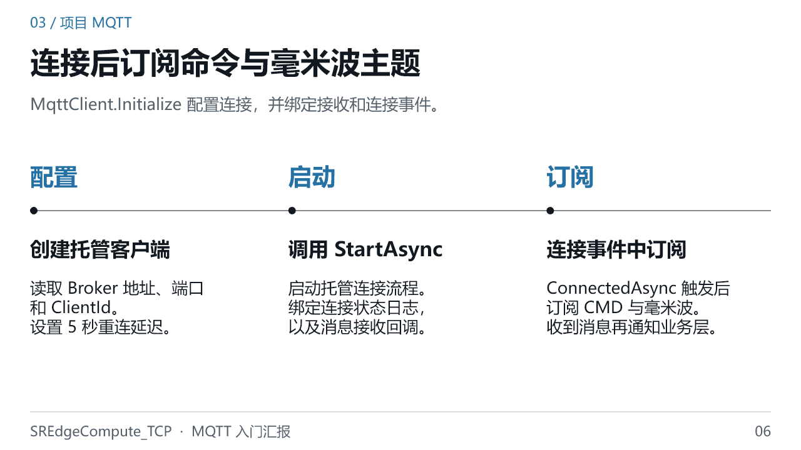

### 口述讲稿

源码先创建 ManagedMqttClient，也就是带托管连接能力的客户端，再填入 Broker 地址、端口和 ClientId，并设置五秒自动重连延迟。随后绑定连接、失败、状态变化和消息接收事件，调用 StartAsync。连接成功事件触发后，AddTopicSubscription 再订阅命令和毫米波主题。这里要区分“代码开始尝试连接”和“连接已经成功”：当前调用 StartAsync 时没有等待它完成，所以不能仅凭初始化日志就断言已经连上 Broker，还要看连接事件与实际订阅情况。

### 为什么

- 把订阅挂在连接事件上，可以在重新连接后再次进入订阅流程；托管客户端负责维护连接和订阅工作。

- 五秒是配置的重连延迟，不是每次断线必定五秒恢复；网络、Broker 和连接尝试本身都会影响恢复时间。

### 可能追问

**问：为什么程序启动了却没有消息？**

启动只说明进程在运行。还要分开确认 Broker 连接、主题订阅、对端发布以及本地消息处理是否正常。

### 过渡

先记住最常用的几个配置值。

源码与协议依据

- S03：`Edge/SREdgeCompute_TCP/SREdgeCompute_TCP/Client/MqttClient.cs:29  [public async Task PublishMessage]`

## 第 07 页 · 配置先看地址、身份与投递等级

建议 90 秒。

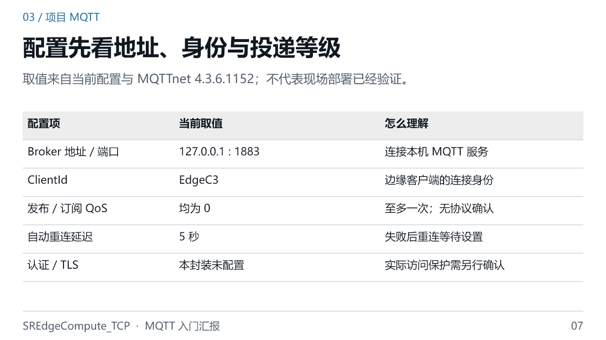

### 口述讲稿

配置里最先看三个东西：连到哪里、我是谁、消息用什么投递等级。127.0.0.1 指运行边缘程序的这台机器，不是任意一台远端服务器；如果 Broker 在另一台机器，部署时就需要正确地址。EdgeC3 是客户端身份，在同一个 Broker 上应避免被别的在线客户端重复使用。当前发布和订阅没有显式传入 QoS，所用库版本的默认值是零，也就是至多一次，没有 MQTT 层面的发布确认。因此不能把正常返回的发送方法理解成对方已经处理成功。

### 为什么

- MQTT 连接依靠 ClientId 区分客户端。重复身份可能导致已有连接被断开，因此它和主题中的 C3 是不同概念。

- QoS 0 是当前库调用默认产生的事实；源码没有说明选择它的设计理由，不能擅自说成经过可靠性权衡的结论。

### 可能追问

**问：换成 QoS 1 就能保证设备执行成功吗？**

不能。QoS 1 提供至少一次的消息投递语义，仍可能重复；业务执行、去重和设备动作结果需要应用自己处理。

### 过渡

下面沿一条命令，看看接收以后发生了什么。

源码与协议依据

- S02：`Edge/SREdgeCompute_TCP/SREdgeCompute_TCP/App.config:1`
- S03：`Edge/SREdgeCompute_TCP/SREdgeCompute_TCP/Client/MqttClient.cs:29  [public async Task PublishMessage]`
- S38：`Edge/SREdgeCompute_TCP/SREdgeCompute_TCP/SREdgeCompute_TCP.csproj:1`
- W01：[OASIS MQTT 3.1.1 标准 §3.1–3.3、§3.8、§4.3、§4.7](https://docs.oasis-open.org/mqtt/mqtt/v3.1.1/os/mqtt-v3.1.1-os.html)
- W02：[MQTTnet v4.3.6.1152 ManagedMqttClientExtensions.cs](https://raw.githubusercontent.com/dotnet/MQTTnet/v4.3.6.1152/Source/MQTTnet.Extensions.ManagedClient/ManagedMqttClientExtensions.cs)

## 第 08 页 · 命令下行经过接收、排队与处理

建议 90 秒。

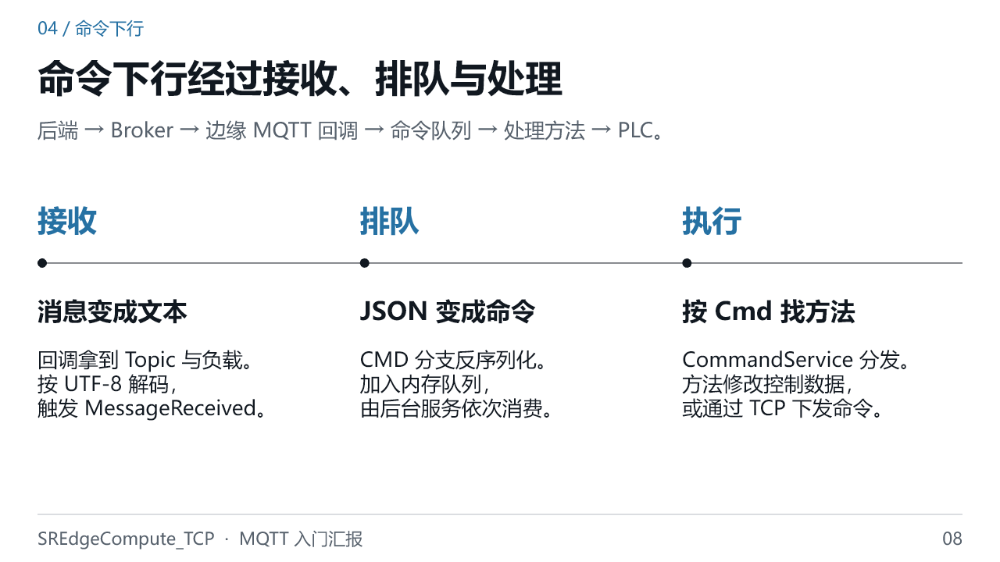

### 口述讲稿

收到 MQTT 消息只是第一步。MqttClient 的回调先把负载按 UTF-8 转为文本，再通过 MessageReceived 通知业务层。CommandQueueService 根据主题分支处理：如果是 CMD，就把 JSON 转成 CommandModel，放入内存队列。后台服务从队列取出命令，等待 CommandService 根据 Cmd 名称执行对应方法。不同方法有不同实现，有的修改共享控制结构，等待周期发送，有的直接组织命令并走 TCP。注意，这里的“依次执行”是软件处理流程，不代表设备已经逐条完成了机械动作。

### 为什么

- 队列把网络接收与命令处理分开，业务方法不必全部堆在 MQTT 回调里；当前实现由后台消费者串行等待。

- 这是进程内存队列，不应把它描述成已经具备重启后恢复或消息永久保存能力。

### 可能追问

**问：所有 MQTT 输入都进这个队列吗？**

不是。毫米波主题有单独分支，调用 SetMMWData 更新数据，不进入普通 CMD 队列。

### 过渡

用一个具体 JSON 看清消息内容。

源码与协议依据

- S03：`Edge/SREdgeCompute_TCP/SREdgeCompute_TCP/Client/MqttClient.cs:29  [public async Task PublishMessage]`
- S05：`Edge/SREdgeCompute_TCP/SREdgeCompute_TCP/Service/CommandQueueService.cs:30  [private void EnqueueCommand]`
- S06：`Edge/SREdgeCompute_TCP/SREdgeCompute_TCP/Service/CommandQueueBackgroundService.cs:15  [protected override async Task ExecuteAsync]`
- S07：`Edge/SREdgeCompute_TCP/SREdgeCompute_TCP/Infrastructure/Commands/CommandRegistry.cs:35  [public int ScanAndRegister]`
- S08：`Edge/SREdgeCompute_TCP/SREdgeCompute_TCP/Service/CommandService.cs:104  [public async Task DistributeCommand]`
- S15：`Edge/SREdgeCompute_TCP/SREdgeCompute_TCP/Service/CommandService.cs:186  [public async Task SetMMWData]`

## 第 09 页 · 一条命令包含 ID、Cmd 和 Value

建议 80 秒。

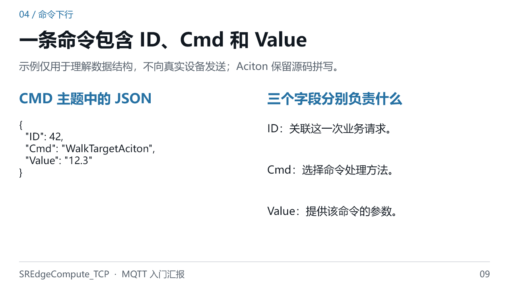

### 口述讲稿

这个例子表达的是一次走行目标命令。ID 为四十二，用来关联本次业务请求与后面的返回结果，它不是 MQTT 的报文编号。Cmd 是命令名称，决定调用哪个处理方法。这里的 WalkTargetAciton 保留了源码实际拼写，不应在演示中自行改成另一个名字。Value 是命令参数，示例中用字符串表示十二点三；其他命令的 Value 可能有别的结构。因此不能只凭字段名就认为任何参数都通用，具体解释和单位要看对应处理方法。

### 为什么

- 命令名称让同一 CMD 主题承载多种操作；业务 ID 则帮助区分同一种操作的多次请求。

- JSON 是应用层数据约定，不是 PLC 二进制帧。参数解析与协议转换仍由命令处理方法完成。

### 可能追问

**问：把 Value 改成任意数字也会正确执行吗？**

不能这样假定。字段存在不等于数值合法；范围、单位和模式条件都需要按具体命令检查，教学示例不能直接用于现场控制。

### 过渡

下行说明“要做什么”，上行则回答“现在是什么状态”。

源码与协议依据

- S08：`Edge/SREdgeCompute_TCP/SREdgeCompute_TCP/Service/CommandService.cs:104  [public async Task DistributeCommand]`
- S09：`Edge/SREdgeCompute_TCP/SREdgeCompute_TCP/Service/CommandService.cs:2895  [public async Task WalkTargetAciton]`
- S35：`Edge/SREdgeCompute_TCP/SREdgeCompute_TCP/Model/Command/ReturnCommandModel.cs:19  [public enum CommandState]`
- W01：[OASIS MQTT 3.1.1 标准 §3.1–3.3、§3.8、§4.3、§4.7](https://docs.oasis-open.org/mqtt/mqtt/v3.1.1/os/mqtt-v3.1.1-os.html)

## 第 10 页 · PLC 状态整理后发布到 STATE

建议 90 秒。

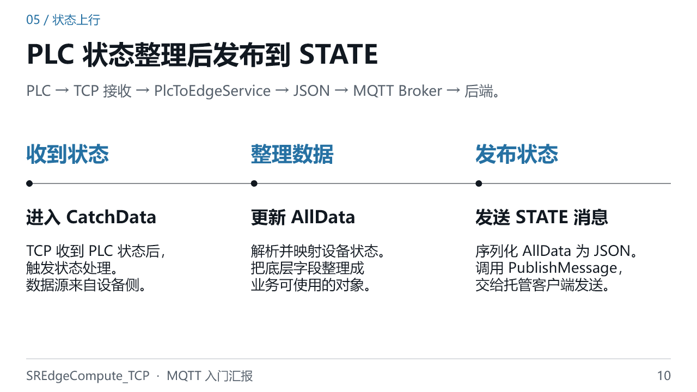

### 口述讲稿

状态上行的起点是 PLC 数据到达。TCP 接收状态后进入 PlcToEdgeService 的 CatchData，先解析底层数据，再通过 UpdateAllData 更新业务对象。之后把 AllData 序列化为 JSON，调用 PublishMessage，主题是当前配置中的 STATE。后端订阅这个主题来获取状态。这里还有两个容易说错的点：STATE 是由 PLC 状态到达事件触发的，不是由配置中的 LoadTime 每五百毫秒触发；PublishMessage 内部调用 EnqueueAsync，表示交给托管客户端的发送队列，不等于后端已经收到了。

### 为什么

- AllData 给上层提供业务对象，减少后端直接理解 PLC 字段布局的需要。

- 状态上报依赖 PLC 状态持续到达；MQTT 保持连接，并不能独立保证这条数据链仍在更新。

### 可能追问

**问：为什么 MQTT 连着，页面状态却不更新？**

可能是 PLC 状态没有到达，也可能卡在映射、发布或后端消费；应沿各个环节观察，不能只检查 MQTT 连接。

### 过渡

除了状态，边缘还会发送回执和心跳，它们的用途不同。

源码与协议依据

- S04：`Edge/SREdgeCompute_TCP/SREdgeCompute_TCP/Client/TCPClient.cs:95  [private async Task ReceiveStream]`
- S11：`Edge/SREdgeCompute_TCP/SREdgeCompute_TCP/Service/PlcToEdgeService.cs:34  [private void CatchData]`
- S03：`Edge/SREdgeCompute_TCP/SREdgeCompute_TCP/Client/MqttClient.cs:29  [public async Task PublishMessage]`

## 第 11 页 · RETURN 与心跳回答不同问题

建议 85 秒。

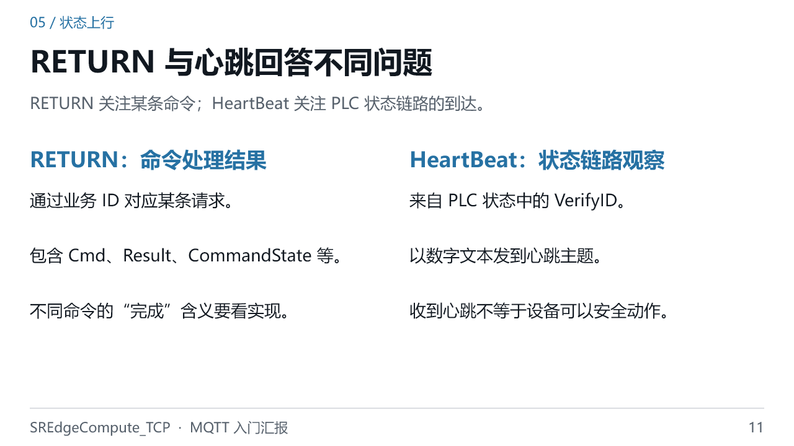

### 口述讲稿

RETURN 是面向某条命令的业务消息，里面包含关联 ID、命令名称和处理状态等信息。它适合回答“刚才那条命令处理到哪一步了”。心跳则不是针对某个命令。边缘程序收到 PLC 状态后，把其中的 VerifyID 作为数字文本发送到心跳主题，用来观察状态链路是否仍在到达。它也不同于 MQTT 协议自身的 Keep Alive：协议保活观察客户端与 Broker 的连接，而这个项目的业务心跳来自 PLC 状态。两者正常都不能替代现场联锁和动作结果判断。

### 为什么

- 持续状态与单次结果的消费方式不同。用业务 ID 可以关联回执，而心跳主要反映数据到达情况。

- 业务心跳在 CatchData 路径中触发，不是边缘另起一个独立定时器，无条件每秒发布。

### 可能追问

**问：心跳正常，就代表 PLC 动作正常吗？**

不代表。它只能提供状态链路到达的证据；设备可运行、联锁满足和动作完成必须结合相应状态与现场控制逻辑。

### 过渡

再用一页补充边缘侧的三个简单功能。

源码与协议依据

- S03：`Edge/SREdgeCompute_TCP/SREdgeCompute_TCP/Client/MqttClient.cs:29  [public async Task PublishMessage]`
- S11：`Edge/SREdgeCompute_TCP/SREdgeCompute_TCP/Service/PlcToEdgeService.cs:34  [private void CatchData]`
- S12：`Edge/SREdgeCompute_TCP/SREdgeCompute_TCP/Service/PlcToEdgeService.cs:632  [private void UpdateHostCommandStatus]`
- S35：`Edge/SREdgeCompute_TCP/SREdgeCompute_TCP/Model/Command/ReturnCommandModel.cs:19  [public enum CommandState]`
- W01：[OASIS MQTT 3.1.1 标准 §3.1–3.3、§3.8、§4.3、§4.7](https://docs.oasis-open.org/mqtt/mqtt/v3.1.1/os/mqtt-v3.1.1-os.html)
- W03：[MQTTnet v4.3.6.1152 MqttClientOptions.cs](https://raw.githubusercontent.com/dotnet/MQTTnet/v4.3.6.1152/Source/MQTTnet/Client/Options/MqttClientOptions.cs)

## 第 12 页 · 三个基础功能支撑消息流转

建议 80 秒。

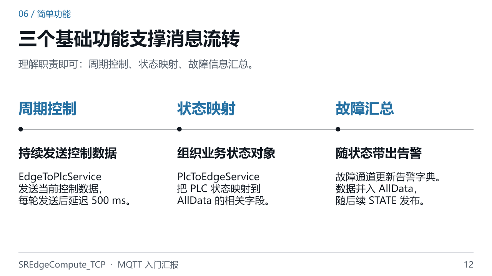

### 口述讲稿

除了 MQTT 封装，边缘程序还需要几个基础功能。第一是周期控制：共享控制数据更新以后，EdgeToPlcService 持续组织并发送，代码每轮发送后延迟五百毫秒。第二是状态映射：把 PLC 的底层字段转换为 AllData 中的业务状态，供上层使用。第三是故障汇总：故障通道整理出的告警信息放进状态对象，随着后续 STATE 一起发出。这三项把通信和实际设备数据连接起来。这里介绍的是数据流，不意味着所有异常分支、告警恢复和现场时序都已经验收。

### 为什么

- “发送后再延迟五百毫秒”包含发送耗时，不是严格每五百毫秒触发的硬实时任务。

- 故障和状态来自不同接收通道，但上层可以通过 STATE 里的聚合对象读取；告警是否及时清除还需单独验证。

### 可能追问

**问：这一页的五百毫秒就是 MQTT 状态发送周期吗？**

不是。它属于边缘到 PLC 的周期控制循环；MQTT STATE 由 PLC 状态到达事件触发，两条路径要分开。

### 过渡

最后强调一次，通信成功和动作完成不能画等号。

源码与协议依据

- S10：`Edge/SREdgeCompute_TCP/SREdgeCompute_TCP/Service/EdgeToPlcService.cs:30  [public EdgeToPlcService]`
- S11：`Edge/SREdgeCompute_TCP/SREdgeCompute_TCP/Service/PlcToEdgeService.cs:34  [private void CatchData]`

## 第 13 页 · 收到消息不等于设备完成动作

建议 90 秒。

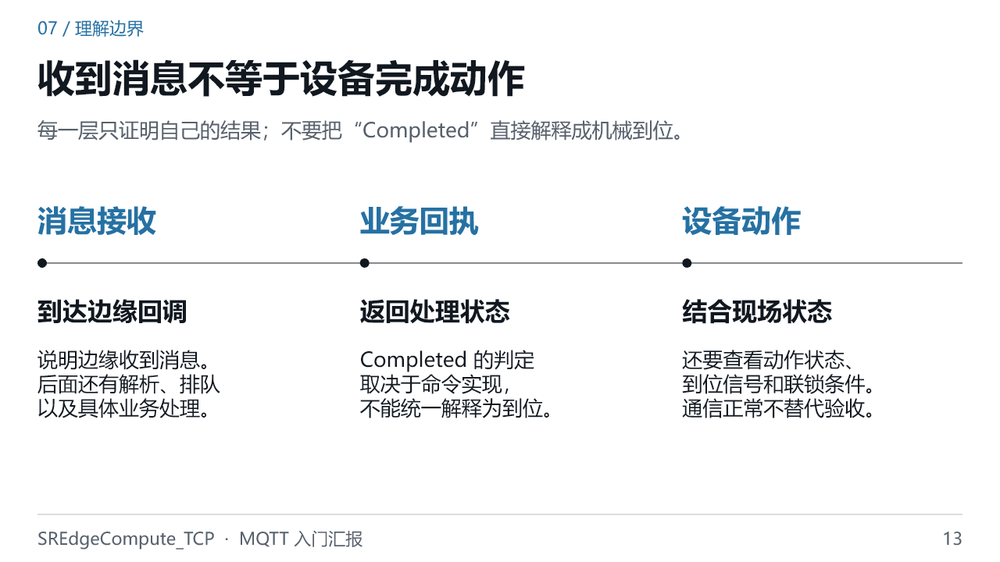

### 口述讲稿

汇报时最需要讲准确的是这三个层次。第一层，边缘回调收到了消息，只能证明消息到达了应用入口。第二层，业务方法返回了处理结果，证明的是该方法定义的阶段。当前项目里，有些命令修改本地控制结构后就返回 Completed；普通主机构命令也有基于 PLC 命令状态的返回判断，因此 Completed 不能一律理解为机械已经到位。第三层才是设备动作结果，需要看相应位置、动作状态和联锁。MQTT 的投递等级同样不能跨过这些层次替我们证明设备完成。

### 为什么

- 软件处理可以很快完成，机械运动却需要时间；不同层的“完成”时间与判定依据自然不同。

- 回执语义来自具体方法，而不是枚举名字本身。遇到追问时要回到发布回执的位置和触发条件。

### 可能追问

**问：那 RETURN 还有用吗？**

有。它用于关联业务请求、报告处理状态和错误；但解释它时必须说明确认到了哪个阶段，而不是把它当作所有动作的最终证明。

### 过渡

把这些层次用于排查，就能知道下一步该查哪里。

源码与协议依据

- S03：`Edge/SREdgeCompute_TCP/SREdgeCompute_TCP/Client/MqttClient.cs:29  [public async Task PublishMessage]`
- S12：`Edge/SREdgeCompute_TCP/SREdgeCompute_TCP/Service/PlcToEdgeService.cs:632  [private void UpdateHostCommandStatus]`
- S35：`Edge/SREdgeCompute_TCP/SREdgeCompute_TCP/Model/Command/ReturnCommandModel.cs:19  [public enum CommandState]`
- S36：`Edge/SREdgeCompute_TCP/SREdgeCompute_TCP/Service/CommandService.cs:273  [public async Task SwitchMode]`
- S37：`Edge/SREdgeCompute_TCP/SREdgeCompute_TCP/Service/CommandService.cs:357  [public async Task SetStop]`
- W01：[OASIS MQTT 3.1.1 标准 §3.1–3.3、§3.8、§4.3、§4.7](https://docs.oasis-open.org/mqtt/mqtt/v3.1.1/os/mqtt-v3.1.1-os.html)

## 第 14 页 · 排查按连接、主题、处理、回传顺序

建议 80 秒。

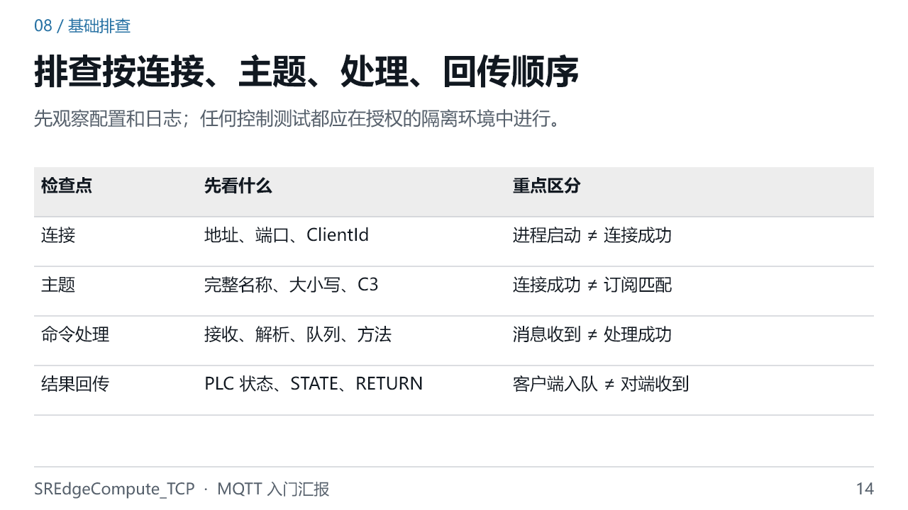

### 口述讲稿

遇到没有响应的问题，可以按四步检查。先查连接地址、端口和客户端身份，区分进程在运行与真正连上 Broker。再查主题，包括开头的斜杠、大小写和设备后缀。第三步看业务处理是否继续往下走：有没有收到消息，JSON 是否解析，队列是否消费，处理方法是否找到。最后再看 PLC 状态和 MQTT 回传。如果日志没有覆盖某个环节，就说明证据还不够，不能用前一环节正常来代替。观察日志和配置可以先做，发送控制报文必须在授权的隔离环境中进行。

### 为什么

- 按链路顺序检查可以逐步缩小范围，而不是一看到界面不更新就修改 MQTT 配置。

- 当前源码并非每个环节都有完整日志，例如 MQTT 收包详细日志被注释；缺日志不等于没有发生，要补充受控观察。

### 可能追问

**问：看到“已订阅”日志就能百分之百确定消息会到吗？**

不能。它是代码执行到该位置的线索；还需要结合实际订阅结果、对端发布、主题权限与接收情况判断。

### 过渡

用最后一页把今天的内容收束为三个结论。

源码与协议依据

- S02：`Edge/SREdgeCompute_TCP/SREdgeCompute_TCP/App.config:1`
- S03：`Edge/SREdgeCompute_TCP/SREdgeCompute_TCP/Client/MqttClient.cs:29  [public async Task PublishMessage]`
- S05：`Edge/SREdgeCompute_TCP/SREdgeCompute_TCP/Service/CommandQueueService.cs:30  [private void EnqueueCommand]`
- S06：`Edge/SREdgeCompute_TCP/SREdgeCompute_TCP/Service/CommandQueueBackgroundService.cs:15  [protected override async Task ExecuteAsync]`
- S11：`Edge/SREdgeCompute_TCP/SREdgeCompute_TCP/Service/PlcToEdgeService.cs:34  [private void CatchData]`
- W01：[OASIS MQTT 3.1.1 标准 §3.1–3.3、§3.8、§4.3、§4.7](https://docs.oasis-open.org/mqtt/mqtt/v3.1.1/os/mqtt-v3.1.1-os.html)

## 第 15 页 · 记住两条方向、五个主题、三层结果

建议 55 秒。

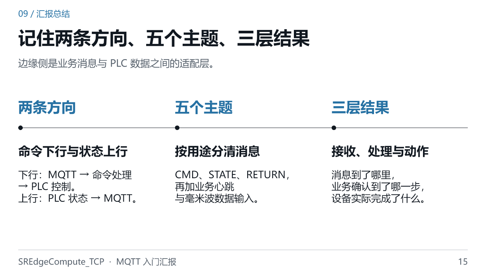

### 口述讲稿

今天可以归纳为三个结论。第一，边缘侧连接业务后端与 PLC，MQTT 是后端和边缘之间的通信方式，边缘和 PLC 之间还有自定义 TCP。第二，项目用五个主题区分命令、状态、回执、心跳和毫米波输入，普通命令经过队列处理，PLC 状态经过映射再发布。第三，判断成功时要分清消息接收、业务处理和设备动作。掌握这条主线后，就能从配置和 MqttClient 入手，沿队列、命令方法及 PlcToEdgeService 继续读源码。以上是本次汇报，谢谢。

### 为什么

- 把概念与源码入口对应起来，后续遇到问题时才能找到证据，而不只是复述术语。

- 本次材料保留简单功能和关键边界；复杂策略与深入实现风险仍可回到原版学习资料继续阅读。

### 可能追问

**问：如果下一步继续学，先学什么？**

先选一条简单命令追到回执，再沿 CatchData 追一次状态发布；熟悉后再学习 PLC 报文和复杂策略。

### 过渡

结束；可根据听众问题回到对应页。

源码与协议依据

- S02：`Edge/SREdgeCompute_TCP/SREdgeCompute_TCP/App.config:1`
- S03：`Edge/SREdgeCompute_TCP/SREdgeCompute_TCP/Client/MqttClient.cs:29  [public async Task PublishMessage]`
- S05：`Edge/SREdgeCompute_TCP/SREdgeCompute_TCP/Service/CommandQueueService.cs:30  [private void EnqueueCommand]`
- S08：`Edge/SREdgeCompute_TCP/SREdgeCompute_TCP/Service/CommandService.cs:104  [public async Task DistributeCommand]`
- S10：`Edge/SREdgeCompute_TCP/SREdgeCompute_TCP/Service/EdgeToPlcService.cs:30  [public EdgeToPlcService]`
- S11：`Edge/SREdgeCompute_TCP/SREdgeCompute_TCP/Service/PlcToEdgeService.cs:34  [private void CatchData]`
- S12：`Edge/SREdgeCompute_TCP/SREdgeCompute_TCP/Service/PlcToEdgeService.cs:632  [private void UpdateHostCommandStatus]`

## 说明与验证边界

保留 MQTT 发布订阅、配置、连接订阅、命令队列、JSON 示例、STATE、RETURN、业务心跳及基础排查。毫米波只交代接收方向与独立处理分支。

不展开堆取料策略、PLC 字节序与帧布局、全命令清单、后端和前端内部实现、深入缺陷分析；这些仍可在原版学习资料中查阅。

所有项目结论基于当前工作区源码；协议依据 OASIS MQTT 3.1.1 与固定 MQTTnet 4.3.6.1152 版本。每页讲稿及 PPT 备注均列出来源。本次未连接真实 PLC 或 MQTT Broker，未作全应用构建、现场控制或部署验收。教学 JSON 不应用于直接控制生产设备。

