# SREdgeCompute_TCP 逐页讲稿：云端阅读版

[学习首页](../README.md) · [源码学习详解](guide.md) · [下载原始HTML](../SREdgeCompute_TCP_逐页讲稿_含原理与答疑.html?raw=1)

保留34页口述、101条原因解释、34组追问答法和原PPT插图。这个在线版适合阅读、查找与复习；原HTML中的计时和交互排练功能需下载后使用。源码引用是位置索引，本仓库不包含项目源码。

## 页码导航

- [第01页：边缘侧代码与通信链路 · SREdgeCompute_TCP](#s1)
- [第02页：边缘侧承担协议适配与指令编排](#s2)
- [第03页：一条业务链路跨越五个参与方](#s3)
- [第04页：目标解决方案包含两类项目](#s4)
- [第05页：启动过程先建立通信，再运行消费循环](#s5)
- [第06页：六个服务构成边缘侧主执行链](#s6)
- [第07页：Protocol 和 Model 处于不同数据层](#s7)
- [第08页：MQTT 通过主题完成发布与订阅](#s8)
- [第09页：QoS 确认的是消息投递层](#s9)
- [第10页：当前 MQTT 使用库默认项与少量配置](#s10)
- [第11页：C3 的五个主题各有明确方向](#s11)
- [第12页：下行从 HTTP 校验进入 MQTT 命令队列](#s12)
- [第13页：状态上行从 TCP 拆帧到界面状态仓库](#s13)
- [第14页：RETURN 把业务 ID 带回后端和前端](#s14)
- [第15页：“完成”在三类命令中含义不同](#s15)
- [第16页：三种心跳分别观察不同对象](#s16)
- [第17页：TCP 使用五种固定布局结构](#s17)
- [第18页：一条走行指令如何变成 18 字节](#s18)
- [第19页：周期控制与脉冲共享同一份结构](#s19)
- [第20页：注册表把命令名映射到处理委托](#s20)
- [第21页：堆料策略固定发送七段点位](#s21)
- [第22页：取料策略以五层数据完成一次确认](#s22)
- [第23页：毫米波数据绕过普通命令队列](#s23)
- [第24页：故障数据并入下一次状态上报](#s24)
- [第25页：保留文件与未实现接口不能当作能力](#s25)
- [第26页：离线探针揭示数据与回执风险](#s26)
- [第27页：运行期可靠性仍需台架验证](#s27)
- [第28页：安全、配置与部署必须单独验收](#s28)
- [第29页：下一步用隔离台架补齐完整证据](#s29)
- [第30页：源码学习可以按七个检查点复述](#s30)
- [第31页：业务报文使用 JSON，PLC 使用字节帧](#s31)
- [第32页：命令覆盖分布集中在堆取料与机构控制](#s32)
- [第33页：结论均可回到源码与验证记录](#s33)
- [第34页：已建立可追踪的边缘侧源码模型](#s34)

对应上一阶段34页PPT，原PPT不改动。版本：2026-08-28。

## 使用方法

先读每页“为什么”，再用“可直接讲”排练。完整版建议约45分钟（问答另计）；精简版约20分钟。正文约6,500汉字，另含英文标识，预算包含指图和停顿，非实测时长。不要把讲者备课内容全部照读。

证据边界：源码事实、设计作用推导、隔离验证、待验证风险和改进建议必须区分。未连接现场PLC/Broker；未验证原工程全量运行；本材料不是生产操作手册。

## 汇报节奏

|页码|内容|完整预算|精简预算|精简讲法|
|---|---|---|---|---|
|1–3|目标与系统边界|3分钟|2分钟|保留第3页的五方链路。|
|4–7|代码结构与生命周期|5分钟|2分钟|其余用一句话带过，解释第6页串行队列。|
|8–11|MQTT原理与项目设置|5分钟|3分钟|重点第9页确认范围、第11页主题方向。|
|12–16|完整链路与确认语义|8分钟|4分钟|重点第12、15页，回执与心跳不混讲。|
|17–24|PLC协议与功能实现|13分钟|5分钟|第18页编码、第21/22页策略差异、第24页告警案例。|
|25–29|实现边界与验证路线|7分钟|3分钟|用第26页已验证结果与第27页待验证风险作对照。|
|30–33|附录查阅与追问|2分钟|不主动展开|告诉听众索引和报文可查，保留作答疑。|
|34|总结|2分钟|1分钟|回到职责、链路、确认边界三个结论。|

## 第01页｜边缘侧代码与通信链路 · SREdgeCompute_TCP

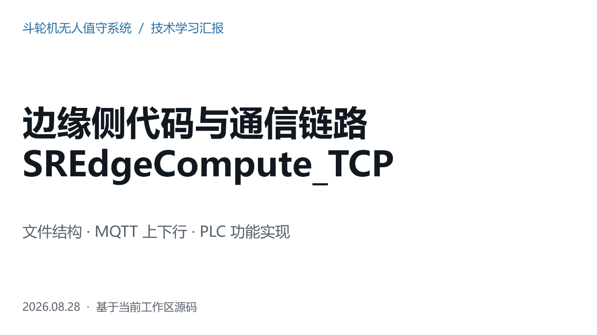

**一句话结论：** 用一条命令和一条状态，讲清边缘程序的职责与边界。

### 可直接讲

今天汇报的是 SREdgeCompute_TCP 这套边缘程序。我会沿着两个问题展开：界面上的一个操作，怎样变成 PLC 能理解的字节；PLC 返回的一组字节，又怎样成为界面上的状态和命令结果。

汇报分三部分：先看代码结构，再看 MQTT 完整通信链路，最后进入控制、策略、告警等功能实现。过程中会特别解释，“消息发出去”和“机械动作完成”为什么不能画等号。

本次依据是当前工作区源码和隔离源码验证，没有连接现场设备。因此，能证明的代码行为会给出依据；涉及 PLC 联锁、现场网络和整机效果的部分，会明确保留验证边界。

### 为什么：讲者需要理解的内容

**理解方法：** 按输入、转换、输出、确认四步读代码，比记类名更容易建立因果关系。后面每一个功能都用这四个问题检查。

**证据边界：** 源码能说明本程序在某个条件下会走什么分支，不能替代未提供的 PLC 程序、部署配置及真实运行记录。

### 追问练习

**问：** 这次学习完成到什么程度？

**答：** 已建立源码调用链，并对帧长、缩放、告警清除和回执条件等做隔离验证；没有完成原工程全量运行或现场验收。

**转场：** 先确定边缘程序在整个系统里究竟负责什么。

**讲述提示：** 开场不用读工程路径；强调“两条链路”和“确认边界”。

**依据：**

- S01 · Edge/SREdgeCompute_TCP/SREdgeCompute_TCP/Program.cs:28
- S38 · Edge/SREdgeCompute_TCP/SREdgeCompute_TCP/SREdgeCompute_TCP.csproj:1

## 第02页｜边缘侧承担协议适配与指令编排

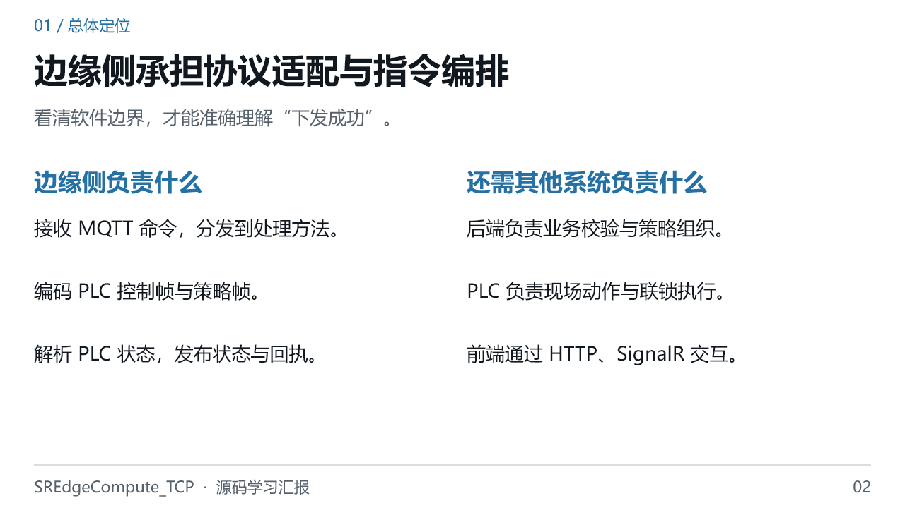

**一句话结论：** 边缘负责协议适配和指令编排，不能仅凭名称认定它承担全部控制算法。

### 可直接讲

边缘程序可以先理解成业务系统和 PLC 之间的适配层。上游后端说的是设备号、命令名和业务参数；下游 PLC 要的是固定字段、机构编号、控制位和字节顺序。边缘负责完成这种转换，并把返回状态重新组织成业务数据。

从代码看，它会接收命令、分发处理、更新周期控制结构、分段发送策略，再发布状态和回执。后端也参与策略组织，前端负责交互。因此不能把所有堆取料算法都归到边缘。

机械动作如何执行、哪些联锁允许动作，需要结合 PLC 程序确认。这里的职责划分，决定了后面每一个“成功”只能证明到哪个环节。

### 为什么：讲者需要理解的内容

**源码事实：** AutoStackActionService 组织策略并序列化 Value；边缘 AutoStackPointCommand 接收后做参数映射、点位分段与确认轮询。

**设计作用（推导）：** 业务模型和 PLC 报文分开后，界面不必知道每个寄存字段。PLC 协议变化主要影响适配层，但仍要检查后端与前端对字段语义的依赖。

**不能反推：** 这里解释的是当前分工带来的作用，不是声称已经知道原作者选择此架构的全部动机。

### 追问练习

**问：** 为什么不让前端直接发 PLC 报文？

**答：** 当前实现通过后端做设备、模式和命令占用校验，再由边缘做协议转换。直接连接会把设备细节与业务界面耦合，也绕开这些已有入口；本项目没有采用这种路径。

**转场：** 明确分工后，下一页把五个参与方连起来。

**讲述提示：** 指左右两栏；“边缘负责转换”之后停顿，再讲 PLC 边界。

**依据：**

- S08 · Edge/SREdgeCompute_TCP/SREdgeCompute_TCP/Service/CommandService.cs:104
- S11 · Edge/SREdgeCompute_TCP/SREdgeCompute_TCP/Service/PlcToEdgeService.cs:34
- S22 · SRIntelligentSystem/SRIntelligentSystem.Application.Dispatch/Manager/CommandManager.cs:53
- S28 · Web/src/api/main/manualStackAction.ts:1
- S29 · Web/src/stores/signalR/allData.ts:72
- S40 · SRIntelligentSystem/SRIntelligentSystem.Application/Command/Control/Auto/AutoStackActionService.cs:60

## 第03页｜一条业务链路跨越五个参与方

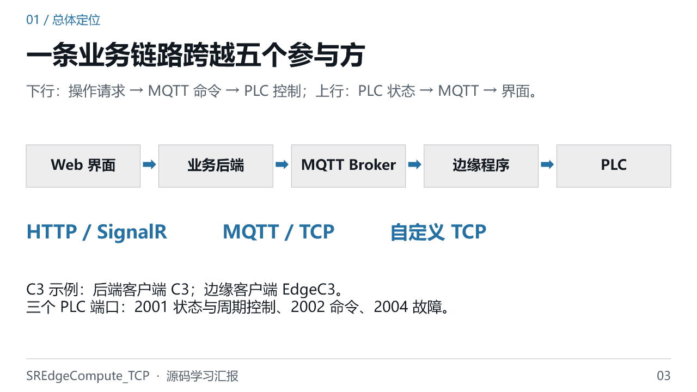

**一句话结论：** Web、后端、Broker、边缘和 PLC 之间，存在三种不同的接口边界。

### 可直接讲

沿着图从左往右看，用户操作首先走 HTTP 到后端，后端将命令发布给 MQTT Broker，Broker 根据主题投递给边缘，最后边缘通过自定义 TCP 协议发送给 PLC。

反向也要分清：PLC 状态经边缘转成 MQTT 数据，后端处理后使用 SignalR 推送界面。所以浏览器在当前主链路中不是 MQTT 客户端，Broker 也不会执行走行或堆料动作。

C3 示例里，后端客户端叫 C3，边缘客户端叫 EdgeC3。PLC 侧还有三个端口：2001 处理状态和周期控制，2002 发动作和策略命令，2004 收故障。排查时要按这些边界定位，不能只问一句“网络通不通”。

### 为什么：讲者需要理解的内容

**源码事实：** Web API、MqttEventSourceStorer、边缘 MqttClient、TCPClient、前端 SignalR 订阅分别构成图中的接口。

**为什么要分边界：** 每段连接有自己的地址、数据格式、失败方式和日志。Broker 可达不表示 PLC 可达；收到状态也不表示命令通道正常。

**工程推导：** 三个 TCP 通道可以分别处理各类数据，但通道分开不等于故障自动隔离，独立连接仍需要各自健康检查与恢复。

### 追问练习

**问：** 三个端口都基于 TCP，为什么不能用一次连通检查？

**答：** 它们是独立连接，2001 正常时 2004 仍可能断开。应分别检查连接、实际收发和恢复过程，而非只看主机能否被访问。

**转场：** 接下来回到源码目录，找到每一段链路对应的文件。

**讲述提示：** 沿图逐段指读协议名；不要把反向链路说成完全相同的业务处理。

**依据：**

- S04 · Edge/SREdgeCompute_TCP/SREdgeCompute_TCP/Client/TCPClient.cs:95
- S22 · SRIntelligentSystem/SRIntelligentSystem.Application.Dispatch/Manager/CommandManager.cs:53
- S23 · SRIntelligentSystem/Plugins/Dhhi.Net.EventBus/MqttEventSourceStorer.cs:23
- S24 · SRIntelligentSystem/SRIntelligentSystem.Application.Dispatch/Subscriber/MqttEventSubscriber.cs:51
- S28 · Web/src/api/main/manualStackAction.ts:1
- S29 · Web/src/stores/signalR/allData.ts:72

## 第04页｜目标解决方案包含两类项目

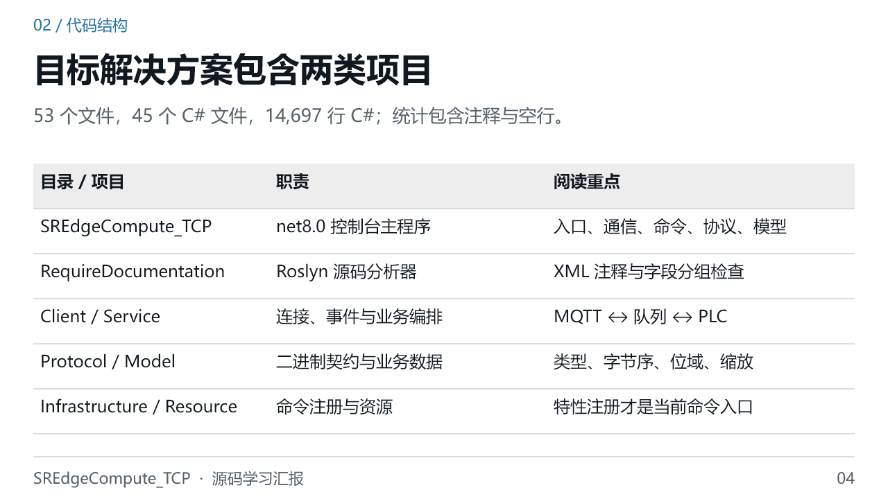

**一句话结论：** 按运行职责读目录，先区分主程序、编译期分析器与历史资源。

### 可直接讲

目标目录有两个项目：一个是 net8.0 边缘主程序，另一个是 RequireDocumentation 源码分析器。分析器检查代码注释和字段分组，不负责现场通信。

主程序可以按职责分层：Client 管连接，Service 管业务流转，Protocol 定义 PLC 字节布局，Model 表达业务数据，Infrastructure 管命令注册。Resource 里的文件是否参与运行，要继续查引用，不能看到就认定它正在使用。

当前统计是53个文件、45个 C# 文件。CommandService 一份文件超过六千行，所以学习时应按命令类别拆开。还有两个 MainData：当前接收链路用的是 Protocol 下的结构，不能把另一套同名状态模型混进来。

### 为什么：讲者需要理解的内容

**为什么分层阅读：** 从 Program 进入 Service，再跟到 Client 与 Protocol，可以先确定实际调用路径；之后再读辅助模型，能减少被历史代码误导的机会。

**编译期与运行期：** 分析器产生的是开发期规范检查结果。存在分析器不表示报文符合 PLC 协议，也不表示动作逻辑已通过测试。

**统计口径：** 45 个 C# 文件中主程序41个、分析器4个；14,697行包括空行和注释。这些数字描述规模，不代表业务复杂度或质量评分。

### 追问练习

**问：** 最先读哪几个文件？

**答：** Program.cs、CommandQueueService.cs、CommandService.cs、EdgeToPlcService.cs、PlcToEdgeService.cs，再按真实调用补读 MQTT/TCP 和协议结构。

**转场：** 知道文件在哪里以后，先看这些对象什么时候被创建和启动。

**讲述提示：** 指目录职责，不逐个念文件；提醒同名 MainData 的区别。

**依据：**

- S01 · Edge/SREdgeCompute_TCP/SREdgeCompute_TCP/Program.cs:28
- S38 · Edge/SREdgeCompute_TCP/SREdgeCompute_TCP/SREdgeCompute_TCP.csproj:1
- S39 · Edge/SREdgeCompute_TCP/RequireDocumentation/FieldGroupAnalyzer.cs:30
- S07 · Edge/SREdgeCompute_TCP/SREdgeCompute_TCP/Infrastructure/Commands/CommandRegistry.cs:35

## 第05页｜启动过程先建立通信，再运行消费循环

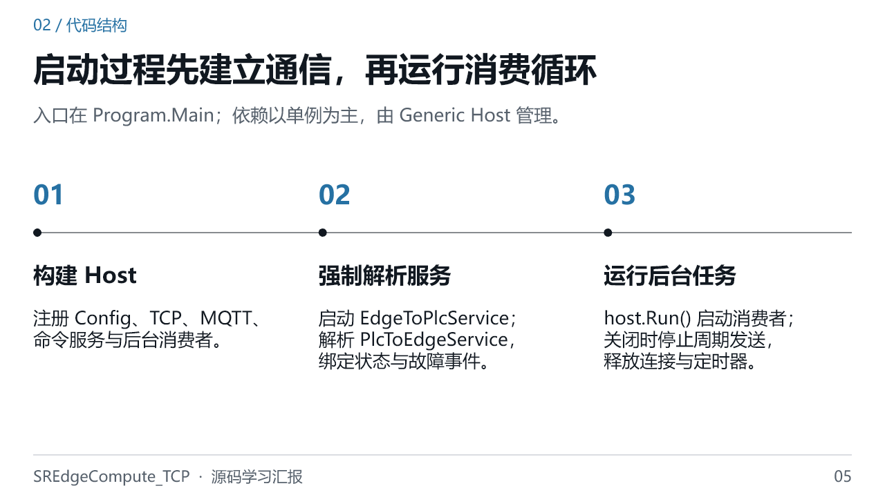

**一句话结论：** 注册服务、创建对象和连接成功，是三个不同的时刻。

### 可直接讲

Program 使用 Generic Host 和依赖注入组织服务。第一步注册配置、客户端和业务服务；第二步主动解析两个 PLC 方向服务；第三步运行 Host，让后台消费者开始工作。

这里有个容易误读的点：注册单例，只是告诉容器怎样创建和复用对象，并不等于对象已经创建。Main 中显式取出 EdgeToPlcService 和 PlcToEdgeService，才使相关初始化和事件绑定实际发生。

同样，启动通信逻辑也不等于连接已经完成。MQTT 的 StartAsync 等调用没有形成完整的等待就绪过程。因此本页标题表达的是启动组织顺序，不能据此保证消费命令前所有网络连接都已可用。

### 为什么：讲者需要理解的内容

**源码事实：** EdgeToPlcService 的注册工厂会调用 Start，并绑定 ApplicationStopping；Main 通过 GetRequiredService 触发创建。

**为什么用单例（作用推导）：** 周期控制结构、通信连接和回执状态需要被多个服务共同使用。复用对象便于共享，但也使并发访问与关闭释放成为必须检查的内容。

**启动就绪条件：** 若要证明系统可接命令，应检查连接、订阅、事件绑定和消费者健康，而不只看 host.Build 或启动日志。此项是后续验证要求。

### 追问练习

**问：** Host 运行了是不是就可以控制？

**答：** 不能这样判断。Host 生命周期与通信就绪不是同一个状态；应建立并验证明确的就绪条件，当前源码没有完整启动门控。

**转场：** 启动完成后，实际消息会在下面六个服务之间流动。

**讲述提示：** 强调三个时刻，避免将“先建立通信”讲成“等待连接成功后才消费”。

**依据：**

- S01 · Edge/SREdgeCompute_TCP/SREdgeCompute_TCP/Program.cs:28
- S06 · Edge/SREdgeCompute_TCP/SREdgeCompute_TCP/Service/CommandQueueBackgroundService.cs:15
- S10 · Edge/SREdgeCompute_TCP/SREdgeCompute_TCP/Service/EdgeToPlcService.cs:30

## 第06页｜六个服务构成边缘侧主执行链

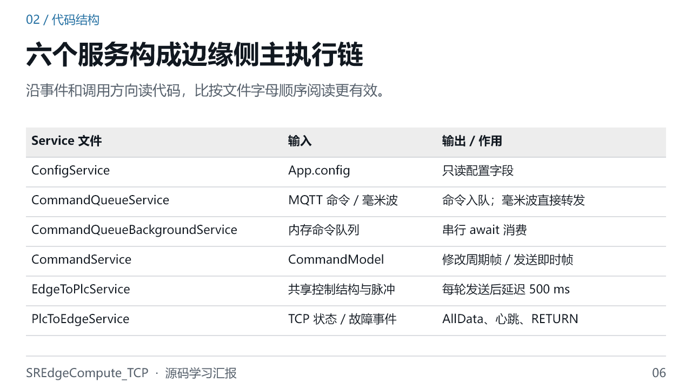

**一句话结论：** 队列把接收与执行分开，但串行等待会影响后续命令。

### 可直接讲

这六个服务可以串成一条主线。配置服务提供参数；MQTT 消息进入 CommandQueueService；后台服务从队列取命令；CommandService 执行具体处理；两个 PLC 方向服务分别负责发送控制和解析上报。

普通命令先进入 ConcurrentQueue，消费者一次等待一条命令执行结束。因此长时间等待策略确认时，后面的命令也会排队。线程安全队列解决的是多个线程同时存取的问题，不会自动提供优先级、持久化和去重。

毫米波是一个例外，它直接更新周期结构，不走普通命令队列。另外，发送后延迟500毫秒只是软件节奏，实际间隔还受发送耗时和调度影响，不能说成严格每秒两次。

### 为什么：讲者需要理解的内容

**为什么加队列（作用推导）：** 接收回调可先保存任务，再交给消费者执行；串行消费也限制了普通命令同时执行。但这把吞吐和时延约束带到了队列中。

**async 的误区：** await 可以释放等待期间的执行线程，但当前循环仍要等这条任务结束才取下一条。异步不等于多条命令并发执行。

**空转边界：** 队列为空时当前循环没有等待通知或 Delay。源码提示可能忙循环，但 CPU 占用程度需要运行测量，不能凭代码给出百分比。

### 追问练习

**问：** 给停止命令设置高 Priority 就能插队吗？

**答：** 不能。当前 Priority 属于注册表同名处理器的选择，不参与 ConcurrentQueue 的顺序；停止命令延迟要单独测量和设计。

**转场：** 消息流转的同时还会改变数据表示，下一页区分两种模型。

**讲述提示：** 把六行合并为“配置—入队—消费—执行—双向PLC”，不用逐行复述。

**依据：**

- S05 · Edge/SREdgeCompute_TCP/SREdgeCompute_TCP/Service/CommandQueueService.cs:30
- S06 · Edge/SREdgeCompute_TCP/SREdgeCompute_TCP/Service/CommandQueueBackgroundService.cs:15
- S08 · Edge/SREdgeCompute_TCP/SREdgeCompute_TCP/Service/CommandService.cs:104
- S10 · Edge/SREdgeCompute_TCP/SREdgeCompute_TCP/Service/EdgeToPlcService.cs:30
- S11 · Edge/SREdgeCompute_TCP/SREdgeCompute_TCP/Service/PlcToEdgeService.cs:34

## 第07页｜Protocol 和 Model 处于不同数据层

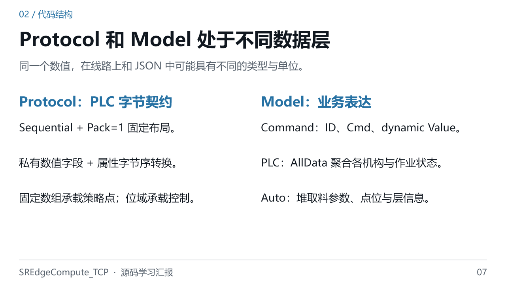

**一句话结论：** Protocol 规定字节怎么排，Model 规定业务怎么表达。

### 可直接讲

Protocol 和 Model 虽然都有位置、模式或命令字段，但它们处于不同层。Protocol 要与 PLC 按字节对齐；Model 要让业务代码和 JSON 能表达命令、状态与策略。

协议结构使用固定布局和 Pack=1，字段类型、顺序、数组长度都会影响最终报文。业务模型则把原始状态整理成主机、辅助机构、堆料、取料和毫米波等对象。

例如界面传入一个带小数的目标值，边缘可能先乘比例转换成 short；回来时又要恢复工程量。因此不能只核对数值相等，还要核对类型、比例和单位。CommandModel 的 Value 是 dynamic，具体格式必须逐条看处理方法，不能认为所有命令都接受同一种 JSON。

### 为什么：讲者需要理解的内容

**布局为什么重要：** Pack=1 限制结构的对齐填充，但不会替你处理字节序，也不会判断物理单位是否正确。Marshal 依据实际字段布局，注释写错不会改变字节。

**转换为什么必要：** 固定比例整数便于用固定宽度字段表达小数；代价是精度和范围受限。采用哪个比例应以每条命令和 PLC 协议约定为准，不能全局猜一个乘数。

**契约风险：** dynamic 将很多格式错误推迟到运行时发现。改为强类型或增加校验属于改进建议，本次没有修改代码。

### 追问练习

**问：** 把属性改名会不会改变报文？

**答：** 不能一概而论。单纯属性名称一般不是 Marshal 的布局依据；真正要查的是底层字段、顺序、类型和序列化逻辑。若同时改变 JSON 名称，也会影响业务接口。

**转场：** 模型的职责清楚了，再看承载这些业务数据的 MQTT。

**讲述提示：** 用“线路字节”和“业务表达”两个词固定认知。

**依据：**

- S16 · Edge/SREdgeCompute_TCP/SREdgeCompute_TCP/Protocol/MainData.cs:1027
- S17 · Edge/SREdgeCompute_TCP/SREdgeCompute_TCP/Protocol/ActionProcessControl.cs:15
- S18 · Edge/SREdgeCompute_TCP/SREdgeCompute_TCP/Protocol/RealTimeControl.cs:15
- S19 · Edge/SREdgeCompute_TCP/SREdgeCompute_TCP/Protocol/StackStrategyProcessControl.cs:14
- S20 · Edge/SREdgeCompute_TCP/SREdgeCompute_TCP/Protocol/ReclaimStrategyProcessControl.cs:10
- S35 · Edge/SREdgeCompute_TCP/SREdgeCompute_TCP/Model/Command/ReturnCommandModel.cs:19

## 第08页｜MQTT 通过主题完成发布与订阅

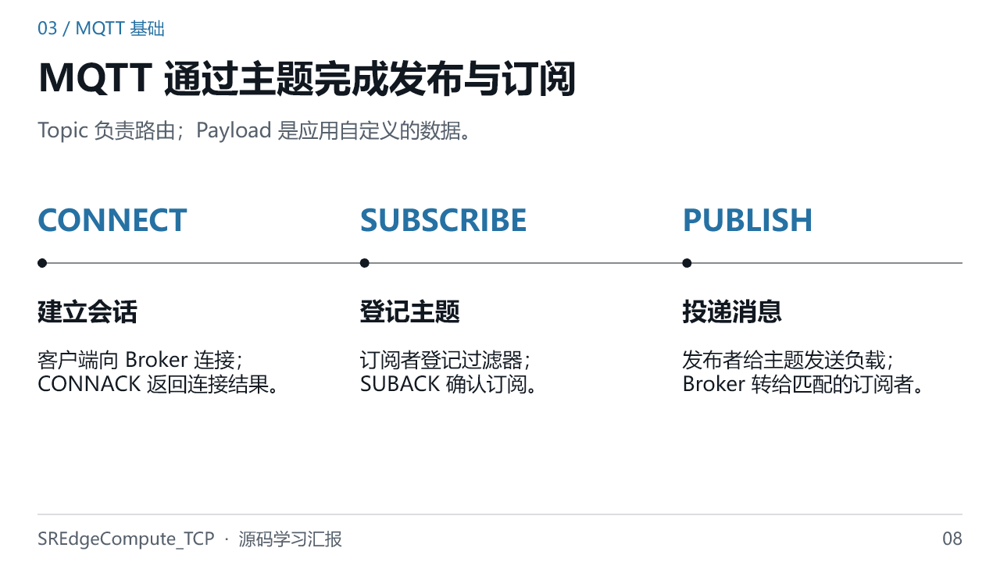

**一句话结论：** MQTT 按主题路由消息，不理解本项目命令的业务含义。

### 可直接讲

MQTT 的基本过程是：客户端连接 Broker，订阅要接收的主题，再向某个主题发布数据。发布者和订阅者可以是同一个客户端，边缘就是既收命令、又发状态。

可以把 Topic 理解为投递地址，Payload 理解为信封里的内容。本项目的 Payload 主要是 JSON 或数字文本。Broker 按地址匹配订阅，不会因为看到了 WalkTargetAciton 就知道怎么驱动走行机构。

主题中的斜杠表示层级，大小写有区别。当前边缘订阅的是配置中的 CMD 和毫米波两个精确主题。后端事件订阅里看到的正则表达式，属于后端内部事件分发，不能直接拿来当 MQTT 主题过滤器。

### 为什么：讲者需要理解的内容

**原理依据：** MQTT 标准区分连接、订阅和发布控制报文；Topic 与应用负载是不同概念。详细规则见本页 OASIS 来源。

**项目中的好处（推导）：** 后端与边缘通过主题交换数据，发送方不必直接调用订阅方的方法；但双方仍共同依赖主题、负载格式和语义约定。

**举例理解：** /MACHINE/CMD/C3 与 /MACHINE/STATE/C3 是不同用途。改动设备后缀或大小写可能使接收路径不匹配，排查应记录完整字符串。

### 追问练习

**问：** C3 是主题还是客户端 ID？

**答：** 两处都可能出现这个字符串，但含义不同。主题末尾的 C3 用于设备路由；ClientId 标识连接身份。它们不会因为同名而自动关联。

**转场：** 主题决定消息送往哪里，下一页看协议能确认到什么程度。

**讲述提示：** 先讲邮递类比，再马上回到真实主题；避免把 Broker 说成业务调度器。

**依据：**

- [OASIS MQTT 3.1.1 标准 §3.1–3.3、§3.8、§4.3、§4.7](https://docs.oasis-open.org/mqtt/mqtt/v3.1.1/os/mqtt-v3.1.1-os.html)
- S03 · Edge/SREdgeCompute_TCP/SREdgeCompute_TCP/Client/MqttClient.cs:29

## 第09页｜QoS 确认的是消息投递层

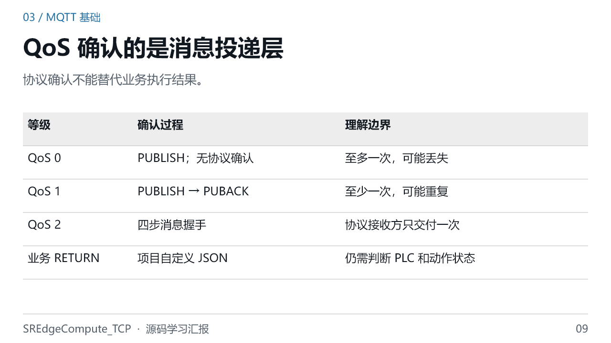

**一句话结论：** QoS 越高也不能自动证明 PLC 动作完成。

### 可直接讲

QoS 描述的是 MQTT 消息交付层。0不做消息级确认，可能丢失；1增加确认，但可能重复；2通过更多握手约束协议接收方的重复交付。

最关键的是确认范围。后端把命令交给 Broker，和边缘把命令交给 PLC，是不同的处理过程。MQTT 不会替我们验证 PLC 是否处于允许模式，也不会检查机构是否到位。

因此，项目才另外定义 RETURN 回执。但 RETURN 也不能只看名字，必须进入代码看它在什么条件下发出。当前两端使用的默认 QoS 是0；即使以后调整 QoS，业务 ID、重复命令处理和动作反馈仍需独立设计。

### 为什么：讲者需要理解的内容

**为什么协议确认不够：** 一条控制命令跨越消息接收、业务执行、TCP 发送、PLC 处理等阶段。某一阶段的确认没有包含后续阶段，就不能据此宣称后续完成。

**重复的业务后果（推导）：** 重复设置同一目标值与重复执行一次增量动作，后果可能不同。是否允许重试，必须按命令语义判断，不能统一补发。

**项目落点：** 普通主机构回执由 CommandStatus 触发，不是 MQTT PUBACK。应将 MQTT QoS 和 ReturnCommandModel.CommandState 分开讲。

### 追问练习

**问：** 直接改 QoS 2 能解决重复执行吗？

**答：** 只能改善相应 MQTT 交付语义，不能覆盖应用主动重发、进程重启后的业务恢复或 PLC 执行幂等；需要端到端关联和去重规则。

**转场：** 理解确认范围后，再看当前代码究竟用了哪些 MQTT 设置。

**讲述提示：** 在“协议接收方”处停顿；不要使用没有边界的“绝对不丢、不重”。

**依据：**

- [OASIS MQTT 3.1.1 标准 §3.1–3.3、§3.8、§4.3、§4.7](https://docs.oasis-open.org/mqtt/mqtt/v3.1.1/os/mqtt-v3.1.1-os.html)
- S12 · Edge/SREdgeCompute_TCP/SREdgeCompute_TCP/Service/PlcToEdgeService.cs:632
- S35 · Edge/SREdgeCompute_TCP/SREdgeCompute_TCP/Model/Command/ReturnCommandModel.cs:19

## 第10页｜当前 MQTT 使用库默认项与少量配置

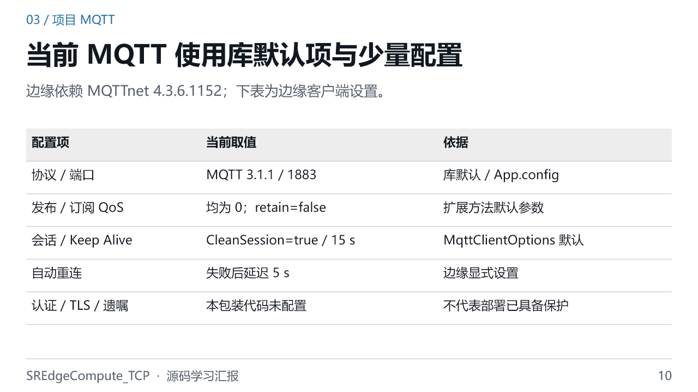

**一句话结论：** 没有显式配置的参数，要按项目锁定的库版本核对默认值。

### 可直接讲

边缘包装类显式设置了 Broker 地址、端口、ClientId，以及5秒自动重连延迟。表中其他值，需要回到项目引用的 MQTTnet 版本核对默认设置。

边缘使用4.3.6.1152，默认 MQTT 3.1.1、CleanSession 为 true、Keep Alive 为15秒；当前发布和订阅调用默认 QoS 为0，发布不保留消息。后端版本是4.3.3.952，两边不能直接说完全同版，但已核对本次使用的发布与订阅默认值。

特别注意 EnqueueAsync：它把消息交给托管客户端队列，返回不代表 PLC 已经接收。包装代码也没有显式设置认证、TLS 或遗嘱，现场是否还有网络隔离和 Broker 权限配置，需要单独查部署。

### 为什么：讲者需要理解的内容

**三个队列/状态不要混淆：** 托管客户端的待发队列、边缘业务 ConcurrentQueue 和 Broker 会话是三种机制；本项目没有接入托管客户端持久存储，不能据此承诺进程重启后不丢任务。

**Retain 的作用：** 保留消息用于新订阅者取得主题最近保留值，不是历史数据库。是否适合控制命令要看过期和重放风险，不能因“方便补收”就开启。

**重连的边界：** 5秒是配置的重连延迟，不是断线后必定5秒恢复；地址错误、服务不可用或网络故障仍会持续阻止连接。

### 追问练习

**问：** Keep Alive 15秒是不是每15秒发一次业务心跳？

**答：** 不是。它属于 MQTT 连接维护；项目的 HeartBeat 主题由 PLC 状态到帧触发。活跃通信时也不能简单理解成固定每15秒额外发一对 ping。

**转场：** 下面把所有业务主题按边缘视角整理成方向表。

**讲述提示：** 指出版本差异；“未配置”要带上“本包装代码中”的限定。

**依据：**

- S02 · Edge/SREdgeCompute_TCP/SREdgeCompute_TCP/App.config:1
- S03 · Edge/SREdgeCompute_TCP/SREdgeCompute_TCP/Client/MqttClient.cs:29
- S41 · SRIntelligentSystem/Plugins/Dhhi.Net.Mqtt/DhhiMqttClient.cs:11
- [MQTTnet v4.3.6.1152 ManagedMqttClientExtensions.cs](https://raw.githubusercontent.com/dotnet/MQTTnet/v4.3.6.1152/Source/MQTTnet.Extensions.ManagedClient/ManagedMqttClientExtensions.cs)
- [MQTTnet v4.3.6.1152 MqttClientOptions.cs](https://raw.githubusercontent.com/dotnet/MQTTnet/v4.3.6.1152/Source/MQTTnet/Client/Options/MqttClientOptions.cs)
- S43 · SRIntelligentSystem/Plugins/Dhhi.Net.Mqtt/Dhhi.Net.Mqtt.csproj:1
- [后端依赖 MQTTnet ManagedClient v4.3.3.952 的默认参数](https://raw.githubusercontent.com/dotnet/MQTTnet/v4.3.3.952/Source/MQTTnet.Extensions.ManagedClient/ManagedMqttClientExtensions.cs)

## 第11页｜C3 的五个主题各有明确方向

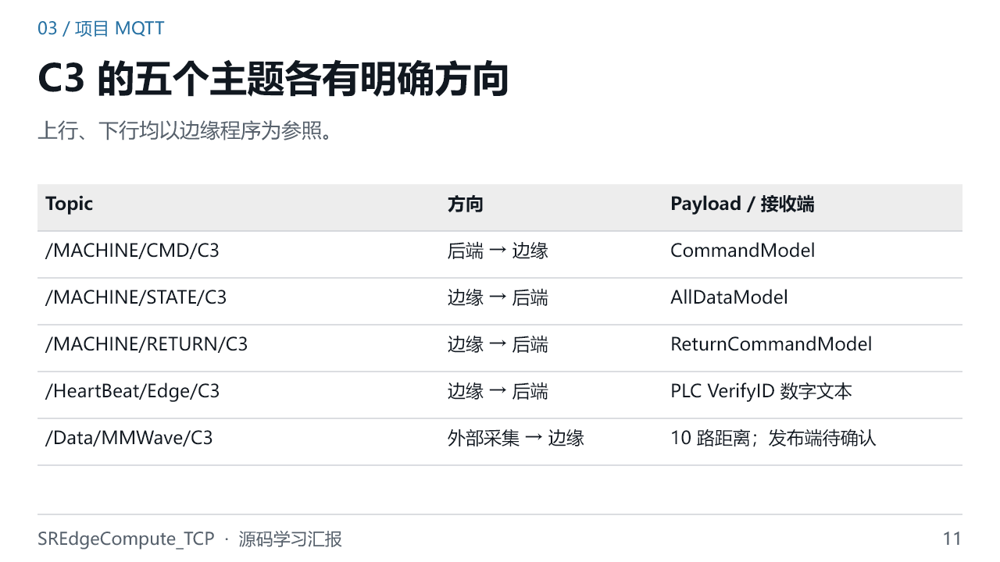

**一句话结论：** 五个主题分别承载命令、状态、回执、心跳和毫米波数据。

### 可直接讲

这里的上行、下行都以边缘为参照。后端通过 CMD/C3 下发命令；边缘通过 STATE/C3 上报聚合状态，通过 RETURN/C3 回报命令处理结果。

HeartBeat/Edge/C3 也由边缘发出，不过内容来自 PLC 状态里的 VerifyID，不是边缘独立生成的定时在线信号。毫米波主题则由边缘订阅，输入十路距离；当前目标源码能追到接收和处理，但没有找到实际发布者。

故障没有单独列一个 MQTT 主题，是因为故障字典被放进 STATE 统一上报。C3 只是当前配置示例，不能把这张表直接复制成所有设备的现场参数。

### 为什么：讲者需要理解的内容

**为什么区分 STATE 和 RETURN：** STATE 表达设备当前状态，RETURN 关联某一次业务命令。两者可以相互辅助判断，但不应互相替代。

**为什么必须注明发布者未知：** 接收代码只能证明边缘期待什么数据，不能证明现场传感器、采集程序或代理以何种频率、单位正确发布。

**主题权限（建议）：** 部署 ACL 可按设备和方向限制发布、订阅，但命名上有 C3 并不自动形成权限隔离；当前源码不能证明 ACL 已配置。

### 追问练习

**问：** 故障通道正常但 STATE 停了，会怎样？

**答：** 故障字典虽可能在边缘更新，但当前上报依赖后续状态发布。没有新的 STATE 时，后端不能靠这条路径及时得到新的故障集合。

**转场：** 从这些主题中选一条 CMD，完整走一次下行。

**讲述提示：** 逐行只讲“谁发、谁收、是什么”；最后强调故障并入 STATE。

**依据：**

- S02 · Edge/SREdgeCompute_TCP/SREdgeCompute_TCP/App.config:1
- S03 · Edge/SREdgeCompute_TCP/SREdgeCompute_TCP/Client/MqttClient.cs:29
- S05 · Edge/SREdgeCompute_TCP/SREdgeCompute_TCP/Service/CommandQueueService.cs:30
- S24 · SRIntelligentSystem/SRIntelligentSystem.Application.Dispatch/Subscriber/MqttEventSubscriber.cs:51
- S25 · SRIntelligentSystem/SRIntelligentSystem.Application.Dispatch/Subscriber/MqttEventSubscriber.cs:251
- S27 · SRIntelligentSystem/Plugins/Dhhi.Net.EventBus/Configuration/Mqtt.json:1

## 第12页｜下行从 HTTP 校验进入 MQTT 命令队列

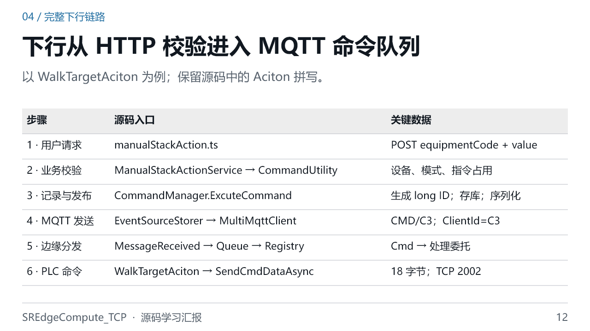

**一句话结论：** 用同一个业务 ID 跟踪从 HTTP 到 PLC 的六个阶段。

### 可直接讲

以走行目标命令为例，前端提交设备号和目标值，后端服务先检查设备、模式和指令占用情况。随后 CommandManager 保存业务命令，取得 long 类型 ID，再把命令名和 Value 序列化。

事件总线接到 MqttEventSource 后，将消息交给对应 MQTT 客户端，发布到 CMD 主题。边缘收到后进行 UTF-8 解码和 JSON 解析，放入队列，由注册表找到 WalkTargetAciton 的处理方法，最后生成18字节动作帧，发送到2002端口。

这条链路里，每个阶段都可能失败或等待。普通接口返回“指令下达成功”，并不意味着已经跑完六步，更不等于机构到位。排查必须带着同一个业务 ID，逐段确认记录、投递、执行和回执。

### 为什么：讲者需要理解的内容

**为什么先保存 ID：** 异步链路中的回执可能晚于 HTTP 响应。业务 ID 让后端将稍后的结果关联到原请求，而不是靠“最近一条命令”猜测。

**实际分发依据：** 服务方法名 SWalkTargetAciton 对应业务 Cmd=WalkTargetAciton；该拼写保留源码中的 Aciton，不能在调用端擅自修正。

**证据应记录什么：** 记录设备号、完整 Topic、业务 ID、Cmd、Value 类型、边缘执行时间、PLC 短序号与回执时间。仅有一条“发布成功”日志不足以覆盖全链路。

### 追问练习

**问：** 为什么接口不一直等到机械到位？

**答：** 当前多数接口采用异步下发，部分调用路径有可选等待。但等待什么结果取决于回执条件；即使等待到 Completed，也必须继续解释其语义。

**转场：** 下行最终变成字节；反方向的字节如何变成界面状态，接着看。

**讲述提示：** 沿六行跟踪一条命令，不把 HTTP 成功说成 PLC 确认。

**依据：**

- S28 · Web/src/api/main/manualStackAction.ts:1
- S30 · SRIntelligentSystem/SRIntelligentSystem.Application/Command/Control/Manual/ManualStackActionService.cs:31
- S31 · SRIntelligentSystem/SRIntelligentSystem.Application.Dispatch/Utility/CommandUtility.cs:69
- S22 · SRIntelligentSystem/SRIntelligentSystem.Application.Dispatch/Manager/CommandManager.cs:53
- S23 · SRIntelligentSystem/Plugins/Dhhi.Net.EventBus/MqttEventSourceStorer.cs:23
- S05 · Edge/SREdgeCompute_TCP/SREdgeCompute_TCP/Service/CommandQueueService.cs:30
- S07 · Edge/SREdgeCompute_TCP/SREdgeCompute_TCP/Infrastructure/Commands/CommandRegistry.cs:35
- S09 · Edge/SREdgeCompute_TCP/SREdgeCompute_TCP/Service/CommandService.cs:2895

## 第13页｜状态上行从 TCP 拆帧到界面状态仓库

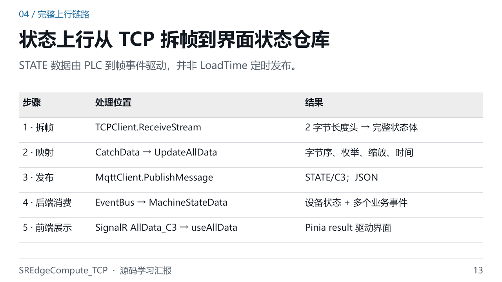

**一句话结论：** 状态显示是“拆帧—映射—发布—后端处理—SignalR更新”的结果。

### 可直接讲

上行首先从 TCP 收到的一段字节开始。TCPClient 根据两字节长度头，累计并取出完整状态体，再交给 MainData 解析。PlcToEdgeService 把协议字段转换成业务模型，包括位置缩放、枚举状态和设备信息。

之后，边缘发布 STATE 消息。后端更新设备状态并派发告警、模式、作业量等业务事件，再通过 AllData_C3 这样的 SignalR 事件推送给前端状态仓库，界面才会刷新。

这里不是 LoadTime 每隔一段时间主动采集一次，而是 PLC 状态到帧驱动的上报。因此界面不更新，要按这五段检查：有没有帧、能否解析、有没有发布、后端是否消费、前端是否订阅。前端还有 mock 分支，联调时要确认数据来源。

### 为什么：讲者需要理解的内容

**为什么需要拆帧：** TCP 交付的是连续字节流，一次读取可能只有半帧，也可能包含多帧。应用必须用长度规则重建报文边界。

**为什么要映射：** PLC 字段适合传输，界面模型适合展示；转换中任何比例或状态解释错误，都可能产生“通信正常但显示错误”。

**触发时序边界：** CatchData 会触发心跳、业务状态和回执处理，但不能仅凭代码调用先后，假定不同异步发布的消息在所有环节形成业务事务。

### 追问练习

**问：** 198字节能接受，为什么还说状态体218字节？

**答：** 当前结构大小218字节，解析器最低接受198字节，缺失扩展区补零。这是兼容行为，不表示缺失字段真的测得了零。

**转场：** 设备状态之外，业务系统还需要知道原来那条命令的处理结果。

**讲述提示：** 按输入到输出讲，不把全部模型字段一一念出。

**依据：**

- S04 · Edge/SREdgeCompute_TCP/SREdgeCompute_TCP/Client/TCPClient.cs:95
- S11 · Edge/SREdgeCompute_TCP/SREdgeCompute_TCP/Service/PlcToEdgeService.cs:34
- S16 · Edge/SREdgeCompute_TCP/SREdgeCompute_TCP/Protocol/MainData.cs:1027
- S23 · SRIntelligentSystem/Plugins/Dhhi.Net.EventBus/MqttEventSourceStorer.cs:23
- S24 · SRIntelligentSystem/SRIntelligentSystem.Application.Dispatch/Subscriber/MqttEventSubscriber.cs:51
- S29 · Web/src/stores/signalR/allData.ts:72

## 第14页｜RETURN 把业务 ID 带回后端和前端

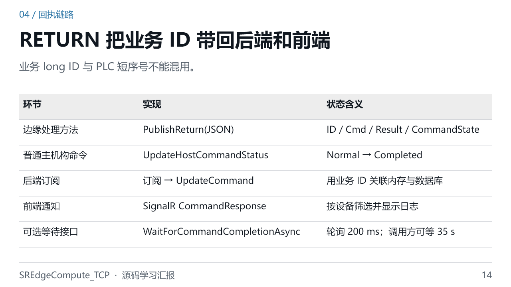

**一句话结论：** RETURN 通过业务 ID 关联请求，但当前主机构确认没有绑定 PLC 动作序号。

### 可直接讲

RETURN 是本项目自己定义的业务回执，里面有 ID、Cmd、Result 和 CommandState。后端收到后，先在内存命令记录中寻找业务 ID，再更新数据库和状态，并通过 CommandResponse 通知前端。

要重点看普通主机构命令。边缘只保留一个当前命令名和业务 ID 槽位；下一次状态处理中，如果 CommandStatus 是 Normal，就生成 Completed 回执。这里没有核对该帧的 ActionCommandID 是否对应这条命令，也没有检查机构是否到位。

所以业务 ID 能让后端找到原请求，但并不自动证明 PLC 反馈属于这次动作。可选等待接口只是等回执状态出现，不会凭空补上这层关联。

### 为什么：讲者需要理解的内容

**两个编号的区别：** 业务 long ID 面向数据库和前端请求；PLC 动作序号面向设备协议且会回绕。二者需要明确映射，不能只因为都叫 ID 就相互替代。

**单槽位风险（推导）：** 如果上一动作尚未得到有效反馈，后来的动作覆盖槽位，状态就可能关联到错误请求。是否发生及后端限流能否约束，需要台架验证。

**生命周期边界：** 后端未找到内存 ID 时会忽略回执；Completed 不走 isCommandStop 的移除分支。是否存在其他清理机制及长期影响，还需继续联调核对。

### 追问练习

**问：** 离线验证具体证明了什么？

**答：** 在设置业务 ID=42 后，输入 ActionCommandID=0、CommandStatus=Normal，代码仍生成 Completed。它证明当前判断缺少动作 ID 关联，不证明现场每次都会误报。

**转场：** 这就引出整个汇报最重要的一页：三类命令的“完成”并不是同一件事。

**讲述提示：** 在“没有动作ID匹配”处停顿；不要把枚举名字解释成物理事实。

**依据：**

- S12 · Edge/SREdgeCompute_TCP/SREdgeCompute_TCP/Service/PlcToEdgeService.cs:632
- S22 · SRIntelligentSystem/SRIntelligentSystem.Application.Dispatch/Manager/CommandManager.cs:53
- S25 · SRIntelligentSystem/SRIntelligentSystem.Application.Dispatch/Subscriber/MqttEventSubscriber.cs:251
- S32 · Web/src/views/main/unmannedSystemOfBucketWheelMachine/main/index.vue:119
- S35 · Edge/SREdgeCompute_TCP/SREdgeCompute_TCP/Model/Command/ReturnCommandModel.cs:19
- S31 · SRIntelligentSystem/SRIntelligentSystem.Application.Dispatch/Utility/CommandUtility.cs:69

## 第15页｜“完成”在三类命令中含义不同

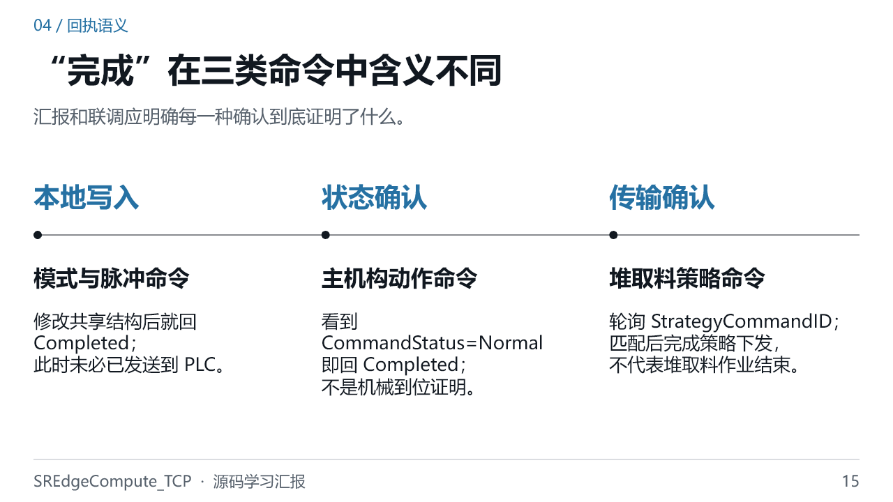

**一句话结论：** 每个 Completed 都必须附带一句：它确认的到底是哪一步。

### 可直接讲

本页把命令分成三类。第一类是模式和脉冲命令，修改本地共享结构后就可能回 Completed，此时周期发送还不一定发生。

第二类是走行这类主机构动作，看到 PLC 的 CommandStatus 为 Normal 就回 Completed，但当前没有动作序号匹配和机械到位判断。

第三类是堆取料策略，等待策略段号匹配后回 Completed，它表示代码认为策略下发结束，不代表作业已经启动，更不代表整堆料完成。

以后汇报和联调时，我会把“成功”说得更具体：本地参数已更新、收到某段策略确认，或者机械反馈已满足完成条件。最后这一项，需要实际反馈证据，不能从前两项直接推出。

### 为什么：讲者需要理解的内容

**为什么同名会造成误解：** 同一个 CommandState 枚举被多条处理路径使用，枚举名称没有约束发送时机。真正语义来自触发条件，而非显示文案。

**SetStop 的具体边界：** 调用 SetPulse 后未使用其返回值就发布成功；重复脉冲被拒绝时，也不能仅凭这份回执判断新停止请求已产生新的控制脉冲。

**建议而非已实现：** 若完善状态机，可明确受理、发送、设备确认、执行中、物理完成和失败等状态，并规定关联 ID、时间戳及超时规则。

### 追问练习

**问：** 那现在的 Completed 是错的吗？

**答：** 至少不能把所有 Completed 统一解释为机械到位。部分路径可能原本只表示处理完成；问题是要明确契约，并修复需要但缺少的关联与反馈判断。

**转场：** 命令完成如此，在线状态也一样，需要知道心跳到底观察了谁。

**讲述提示：** 本页是核心页，可慢讲；三种完成各举一个命令名即可。

**依据：**

- S36 · Edge/SREdgeCompute_TCP/SREdgeCompute_TCP/Service/CommandService.cs:273
- S37 · Edge/SREdgeCompute_TCP/SREdgeCompute_TCP/Service/CommandService.cs:357
- S12 · Edge/SREdgeCompute_TCP/SREdgeCompute_TCP/Service/PlcToEdgeService.cs:632
- S13 · Edge/SREdgeCompute_TCP/SREdgeCompute_TCP/Service/CommandService.cs:3451
- S14 · Edge/SREdgeCompute_TCP/SREdgeCompute_TCP/Service/CommandService.cs:4760

## 第16页｜三种心跳分别观察不同对象

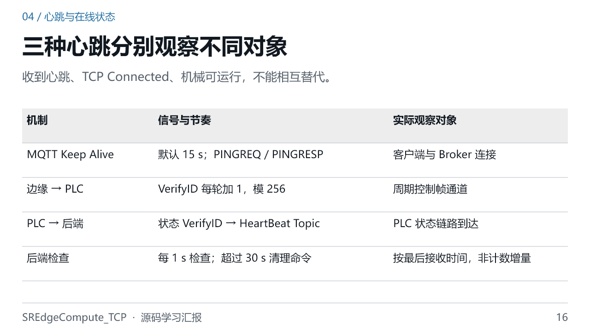

**一句话结论：** 心跳只能证明它覆盖的那段链路，不能证明设备安全可运行。

### 可直接讲

系统里有三种容易被叫成心跳的东西。MQTT Keep Alive 维护客户端和 Broker 的连接；边缘周期帧中的 VerifyID 用来标识持续发送；PLC 状态里的 VerifyID 又被边缘转发到后端心跳主题。

最后一种尤其需要注意：后端每次收到消息都会更新最后接收时间，没有检查计数是否变化。因此即使同一个数反复到达，也可能让设备继续显示在线。

后端每秒检查，超过30秒没有更新时会清理设备命令相关状态。当前这段代码没有主动下发现场急停。所以“后台判定离线”与“PLC如何安全处置通信丢失”，是两个需要分别验证的问题。

### 为什么：讲者需要理解的内容

**为什么计数和时间要分开：** 接收时间回答“近期是否有消息到达”，计数变化可辅助判断“数据源是否推进”。二者都不能单独证明所有控制与反馈链路健康。

**Keep Alive 不是定时业务消息：** 15秒是 MQTT 连接维护参数，不能直接套成 PLC 状态周期或后端超时阈值。项目30秒检查是另一套应用逻辑。

**安全边界：** PLC 对边缘心跳丢失的动作，本次没有 PLC 程序可供验证。不得把后端清缓存当成设备安全停机机制。

### 追问练习

**问：** 收到心跳但界面位置不变，怎么解释？

**答：** 先看位置是否本来不变，再检查原始帧和计数是否更新、映射和 STATE 是否正常。心跳到达只覆盖一部分证据，不能排除冻结或展示问题。

**转场：** 下面进入 PLC 协议本身，先把帧长和长度头说清楚。

**讲述提示：** 区分“连接活着、数据更新、机械可运行”三个层次。

**依据：**

- [MQTTnet v4.3.6.1152 MqttClientOptions.cs](https://raw.githubusercontent.com/dotnet/MQTTnet/v4.3.6.1152/Source/MQTTnet/Client/Options/MqttClientOptions.cs)
- S10 · Edge/SREdgeCompute_TCP/SREdgeCompute_TCP/Service/EdgeToPlcService.cs:30
- S11 · Edge/SREdgeCompute_TCP/SREdgeCompute_TCP/Service/PlcToEdgeService.cs:34
- S26 · SRIntelligentSystem/SRIntelligentSystem.Application.Dispatch/Job/HeartBeatChecker.cs:20
- S42 · SRIntelligentSystem/SRIntelligentSystem.Application.Dispatch/Manager/EquipmentsManager.cs:94

## 第17页｜TCP 使用五种固定布局结构

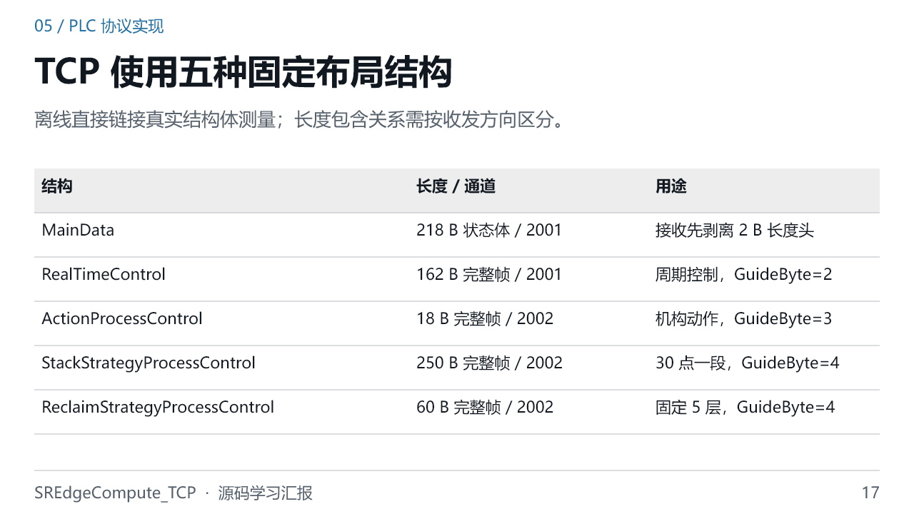

**一句话结论：** 字节帧要逐种核对长度口径，不能把同一个公式套到收发两端。

### 可直接讲

PLC 主链路中有五种固定结构。当前 MainData 状态体是218字节，接收时前面还有两字节长度头，因此完整当前状态报文是220字节。周期控制帧是162字节，动作帧18字节，堆料段250字节，取料帧60字节。

为什么要强调“状态体”和“完整帧”？因为发送结构的 Length 字段本身就在结构内，而接收流程先剥掉长度头再交给 MainData。若把同一个加二公式套到所有方向，就会从第一帧开始错位。

还要以真实字段类型为准。动作帧实际是九个 short，不是旧注释里的一字节字段。堆料和取料当前调用的 GuideByte 都是4，不能拿未调用辅助方法里的值替代真实发送路径。

### 为什么：讲者需要理解的内容

**怎样推导尺寸：** 动作帧9×2=18；堆料5×2+4×30×2=250；取料5×2+5×5×2=60。这里的 short 占2字节，结构以固定布局发送。

**名称不等于宽度：** 字段叫 GuideByte 也不表示它必然只占一个字节。应检查类型、内存布局和序列化输出。

**错误通道另算：** 故障接收使用一字节长度头，得到报文体后再跳过一字节引导符；不能与2001状态拆帧混用。

### 追问练习

**问：** 218字节可以当成固定PLC协议标准吗？

**答：** 它是当前 C# 结构与隔离测量结果，不是通用标准。上线要与现场确认版本的协议表、PLC结构和抓帧结果逐项比对。

**转场：** 有了帧的整体结构，再拿一个12.3的走行目标逐字节解释。

**讲述提示：** 指长度列时带上“体/完整帧”；现场可口算18、250、60。

**依据：**

- S04 · Edge/SREdgeCompute_TCP/SREdgeCompute_TCP/Client/TCPClient.cs:95
- S16 · Edge/SREdgeCompute_TCP/SREdgeCompute_TCP/Protocol/MainData.cs:1027
- S17 · Edge/SREdgeCompute_TCP/SREdgeCompute_TCP/Protocol/ActionProcessControl.cs:15
- S18 · Edge/SREdgeCompute_TCP/SREdgeCompute_TCP/Protocol/RealTimeControl.cs:15
- S19 · Edge/SREdgeCompute_TCP/SREdgeCompute_TCP/Protocol/StackStrategyProcessControl.cs:14
- S20 · Edge/SREdgeCompute_TCP/SREdgeCompute_TCP/Protocol/ReclaimStrategyProcessControl.cs:10
- 隔离验证：.codex-build/sredge-20260828/probe/Probe.csproj 与 Program.cs；2026-08-28；.NET SDK 9.0.301；直接链接真实协议和 PlcToEdgeService 源码。仅配置、日志、JSON、网络依赖使用替身，不等于 net8.0 全应用测试。

## 第18页｜一条走行指令如何变成 18 字节

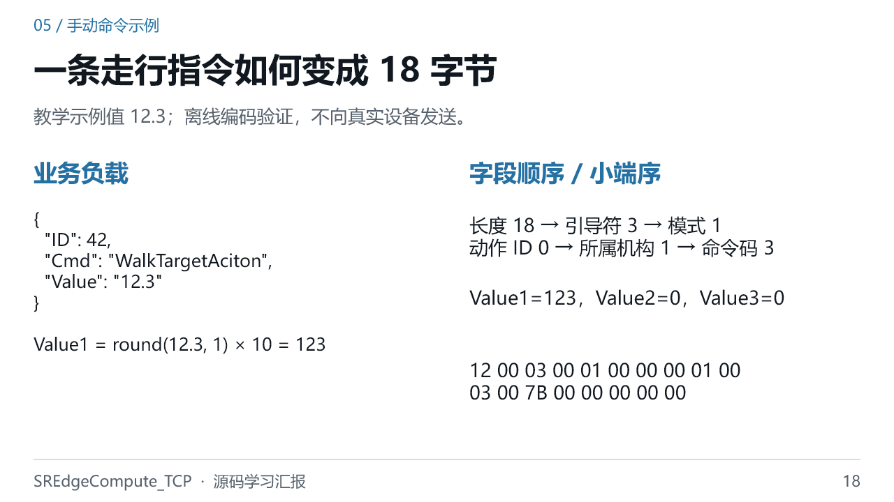

**一句话结论：** 业务 ID、工程值和 PLC 序号在编码时各自承担不同职责。

### 可直接讲

这个例子只用于离线解释。外层业务 ID 是42，命令是 WalkTargetAciton，Value 是字符串12.3。边缘把它解析成数值，保留一位小数后乘10，得到整数123，写入 Value1。

动作帧共有九个 short：长度18、引导符3、模式1、动作序号、机构1、命令码3，以及三个参数。本例假定动作计数器初始为0；业务 ID 42不会直接出现在这18字节里。

小端序下，123是十六进制007B，低字节先发，所以是7B 00。这里还发现一个输入边界：TryParse 失败时只记录日志，没有停止，默认值0可能继续被编码。这说明协议学习必须连同参数校验一起看。

### 为什么：讲者需要理解的内容

**缩放为什么用整数：** 12.3×10=123，在该命令的协议比例下可用 short 保存一位小数。并不意味着所有位置命令、所有策略都使用同一个物理单位。

**数学范围与业务范围：** short 的编码范围是有限的；乘10后还要装入 short。即使数值能装下，也不代表处于设备允许行程，编码校验和业务限位都需要。

**零值为什么危险：** 解析失败产生的默认0与用户明确输入0，在后续编码中难以区分。正确改进方向是先明确无效输入分支，不是简单把0判成非法。

### 追问练习

**问：** 为什么 ID=42，PLC动作ID却是0？

**答：** 42是后端请求的业务 ID；0是本例初始 PLC 动作计数器值。该计数器为 byte 并回绕，写到协议 short 字段；两者需要关联但不能混为一个号。

**转场：** 动作帧立即发送，而很多参数先写共享结构，下一页看这条周期路径。

**讲述提示：** 只展开7B 00这一组字节，其余按字段顺序读；不要现场发送示例。

**依据：**

- S09 · Edge/SREdgeCompute_TCP/SREdgeCompute_TCP/Service/CommandService.cs:2895
- S17 · Edge/SREdgeCompute_TCP/SREdgeCompute_TCP/Protocol/ActionProcessControl.cs:15
- 隔离验证：.codex-build/sredge-20260828/probe/Probe.csproj 与 Program.cs；2026-08-28；.NET SDK 9.0.301；直接链接真实协议和 PlcToEdgeService 源码。仅配置、日志、JSON、网络依赖使用替身，不等于 net8.0 全应用测试。

## 第19页｜周期控制与脉冲共享同一份结构

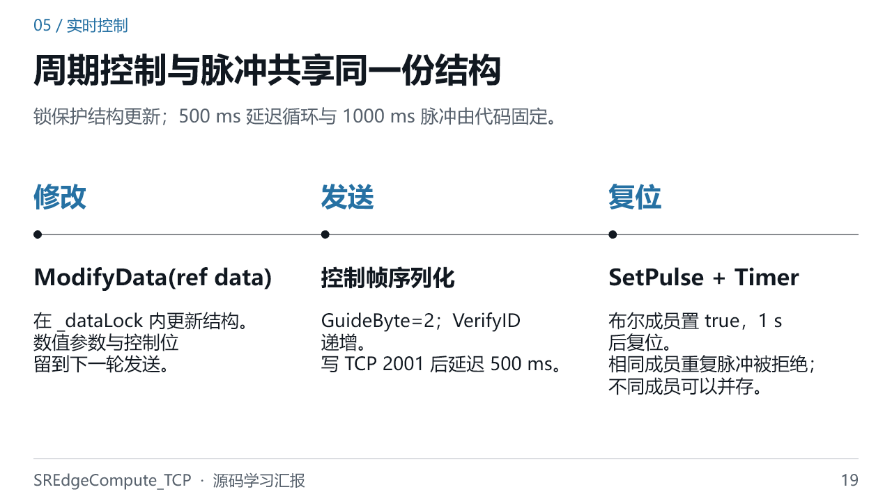

**一句话结论：** 锁保证本地结构修改一致，但不保证脉冲已经被 PLC 看到。

### 可直接讲

周期控制维护一份 RealTimeControl 结构。业务命令通过 ModifyData 在锁内更新它，发送任务也在锁内更新心跳字段并序列化，再到锁外写入2001端口，发送后延迟500毫秒。

脉冲也是修改这份结构：把某个布尔成员置为 true，定时器在1秒后复位。相同成员已有脉冲时，新请求会被拒绝；不同成员可以同时存在。

这里的锁解决的是共享内存访问，不是网络送达。如果发送期间断线，脉冲可能在 PLC 实际收到之前已经复位。也不能说1秒脉冲必定发送两次，因为循环还包含发送耗时、重试和线程调度。软件停止走这条链路，不能代替独立的硬件安全回路。

### 为什么：讲者需要理解的内容

**锁内序列化、锁外发送：** 当前循环在 _dataLock 内生成字节数组，再锁外 await TCP 发送，避免长时间占着数据锁等待网络。辅助 GetData 虽返回结构体副本，但不是当前发送循环的取数入口。

**为什么装箱再拆箱：** SetPulse 通过反射修改结构体成员，先装箱为对象，修改后必须拆箱写回 _data；否则可能只改了临时副本。

**脉冲确认的缺口：** “本地位已置真”与“PLC曾采样到真”是两个事件。要证明后者，需要设备反馈或明确的握手机制，当前定时复位本身不提供这个证明。

### 追问练习

**问：** 加大脉冲时间能彻底解决吗？

**答：** 不能。延长只改变时间窗口，还可能改变动作语义；通信中断与反馈缺失仍存在。应结合 PLC 协议和安全要求设计确认，并在台架测量。

**转场：** 下面看 CommandService 如何选择刚才这些处理方法。

**讲述提示：** 抓住“本地锁≠远端确认”；不要把500毫秒称为硬实时周期。

**依据：**

- S10 · Edge/SREdgeCompute_TCP/SREdgeCompute_TCP/Service/EdgeToPlcService.cs:30
- S18 · Edge/SREdgeCompute_TCP/SREdgeCompute_TCP/Protocol/RealTimeControl.cs:15
- S37 · Edge/SREdgeCompute_TCP/SREdgeCompute_TCP/Service/CommandService.cs:357

## 第20页｜注册表把命令名映射到处理委托

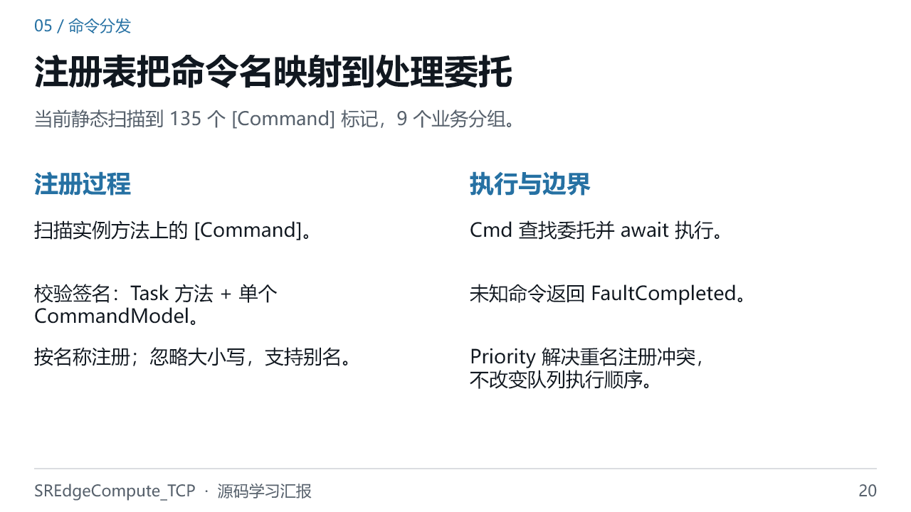

**一句话结论：** 真正决定 MQTT 可调用能力的是注册路径，不是方法名或 XML 文件。

### 可直接讲

CommandRegistry 启动扫描实例方法上的 Command 特性，检查返回值必须是 Task，参数必须是一个 CommandModel，再创建处理委托并按命令名保存。

收到命令时，注册表按 Cmd 查找并执行。名称匹配忽略大小写，一个方法可以有多个别名；未找到时返回 FaultCompleted。Enabled 可以禁用注册，Priority 处理同名冲突，数值较小的优先。

当前静态统计有135个 Command 标记，分为9组。但静态标记数不等于现场验收数，也不应只看 public 方法数量。Resource 里的 CommandXml 当前没有进入加载链路，不能用它作为正在支持的命令清单。

### 为什么：讲者需要理解的内容

**为什么用特性（作用推导）：** 命令名、分组和说明与方法放在一起，注册时能统一发现和校验；后续执行用委托查找，避免每条消息都编写长分支。

**扩展时需要什么：** 不能只新增一个同名方法。还需特性、有效签名、注册成功、明确 Value 契约、业务与协议校验，以及与回执语义一致的测试。

**Priority 的真实范围：** 它参与“同名命令由哪个处理器负责”的选择，不决定消息先后顺序，也没有赋予停止命令抢占能力。

### 追问练习

**问：** 改 XML 就能增加新命令吗？

**答：** 当前运行路径没有加载该 XML，因此不能。应以 CommandRegistry 的实际扫描来源和 CommandService 的有效注册为准。

**转场：** 普通命令理解以后，再看两个较复杂的策略传输流程。

**讲述提示：** 将“静态标记数、运行注册数、现场通过数”分别说清。

**依据：**

- S07 · Edge/SREdgeCompute_TCP/SREdgeCompute_TCP/Infrastructure/Commands/CommandRegistry.cs:35
- S08 · Edge/SREdgeCompute_TCP/SREdgeCompute_TCP/Service/CommandService.cs:104

## 第21页｜堆料策略固定发送七段点位

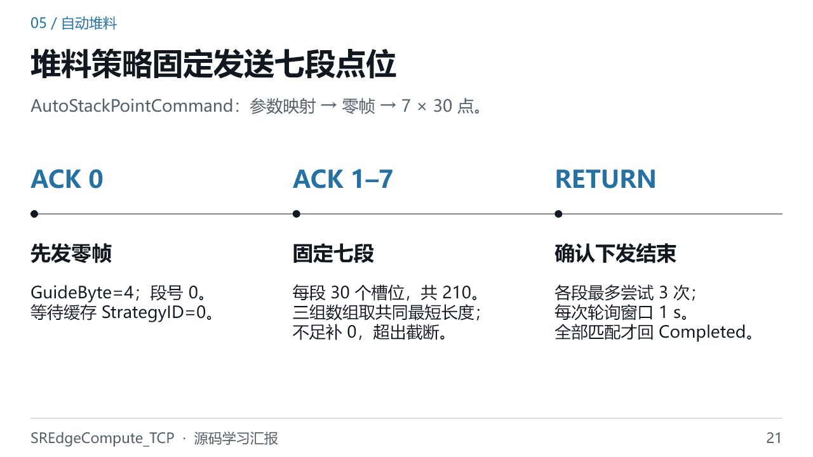

**一句话结论：** 堆料策略是“参数更新＋固定七段传输＋段号确认”，不是原子事务。

### 可直接讲

自动堆料先把完整参数写入周期控制结构，再发段号0的零帧进行确认，之后固定发送七段，每段30个点位槽，共210个槽位。

三个坐标数组取共同最短长度，同时受210限制。不足的部分补零，超出部分截断。每段250字节，按当前段号轮询确认；每次等待窗口1秒，最多尝试3次。所有段都满足条件才回 Completed。

这里要讲两个边界：第一，参数更新和策略分段不构成事务，中途失败时 PLC 可能已经看到部分更新。第二，确认只比较缓存里的 StrategyID，没有证明它来自这一次发送之后的新反馈。因此下发完成不能直接解释为策略已经安全生效或作业结束。

### 为什么：讲者需要理解的内容

**为什么是七段：** 它是当前代码固定循环与每段30槽位共同决定的实现约束，不是 MQTT 限制，也不是已经证明的 PLC 最大能力。

**零帧的作用与边界：** 从发送顺序看，0可作为这轮传输开始前的确认步骤；但若缓存原本就是0，单纯相等不能证明 PLC 刚完成新的复位或准备。具体 PLC 语义仍要核对。

**补零不是业务合法性：** 长度补齐满足字节格式，不代表零点位在现场一定是无效点或安全点。需要确认有效数量、点号和 PLC 对补齐槽位的解释。

### 追问练习

**问：** 第三段失败后，能否保证前两段没生效？

**答：** 不能。当前 C# 方法会停止并返回失败，但没有实现 PLC 已接收数据的回滚事务。应记录批次和已确认段，并用台架验证失败后的状态。

**转场：** 取料也有策略确认，但它的帧结构和重试方式不同。

**讲述提示：** 画面中的7×30先口算210；不要把“最多尝试3次”说成重试3次。

**依据：**

- S13 · Edge/SREdgeCompute_TCP/SREdgeCompute_TCP/Service/CommandService.cs:3451
- S19 · Edge/SREdgeCompute_TCP/SREdgeCompute_TCP/Protocol/StackStrategyProcessControl.cs:14
- S40 · SRIntelligentSystem/SRIntelligentSystem.Application/Command/Control/Auto/AutoStackActionService.cs:60

## 第22页｜取料策略以五层数据完成一次确认

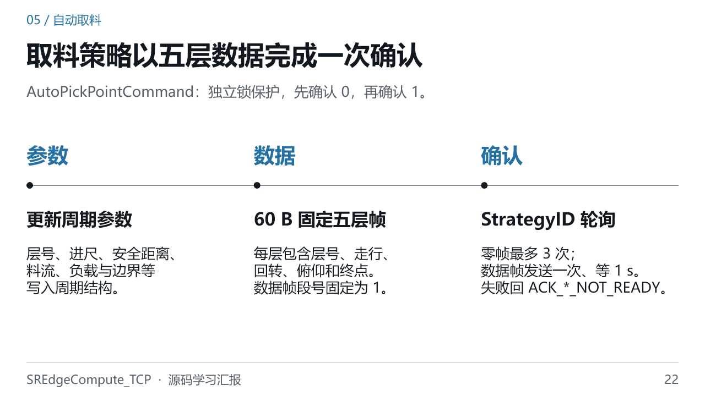

**一句话结论：** 取料固定五层，零帧重试与数据帧发送次数必须分别解释。

### 可直接讲

自动取料首先更新层号、进尺、料流、边界等周期参数，再通过零帧确认，随后发送固定五层的数据帧。每层包含层号、走行、回转、俯仰和终点，完整帧60字节，数据段号固定为1。

这条路径与堆料不能套用同一套重试描述。取料零帧最多尝试3次，但实际五层数据帧只发送一次，再等待1秒；没有确认就返回对应的 ACK_NOT_READY 错误。

方法名里虽然有 EdgeIfNeeded，实际条件仍只是缓存段号等于预期，并未检测新帧边沿。另有取料入口锁保护，但锁也不能证明 PLC 已接收正确的新策略。策略传输和开始取料是不同命令，不能把两者混在一起。

### 为什么：讲者需要理解的内容

**五层结构怎么算：** 5个 short 头字段占10字节，5组数组各5个 short 共50字节，总计60。固定布局决定当前传输形状。

**锁为什么不等于可靠性：** 入口锁限制同一段代码的并发进入，不能解决缓存反馈陈旧、网络丢失或业务请求重复。不同问题需要不同证据。

**命名不能替代条件：** 理解 WaitForExpectedWithEdgeIfNeededAsync 时，应看循环实际比较什么。名字暗示了边沿处理，不代表代码确实做了新旧反馈区分。

### 追问练习

**问：** 取料为什么不像堆料每段都多次尝试？

**答：** 源码确实存在这种差异，但仅凭实现不能断言作者是基于哪条现场需求选择的。应核对协议和需求；讲稿只报告现状及其验证影响。

**转场：** 除了命令与策略，还有一条不经过普通队列的毫米波输入。

**讲述提示：** 突出“零帧最多3次、数据帧1次”；不要把方法名当作保证。

**依据：**

- S14 · Edge/SREdgeCompute_TCP/SREdgeCompute_TCP/Service/CommandService.cs:4760
- S20 · Edge/SREdgeCompute_TCP/SREdgeCompute_TCP/Protocol/ReclaimStrategyProcessControl.cs:10

## 第23页｜毫米波数据绕过普通命令队列

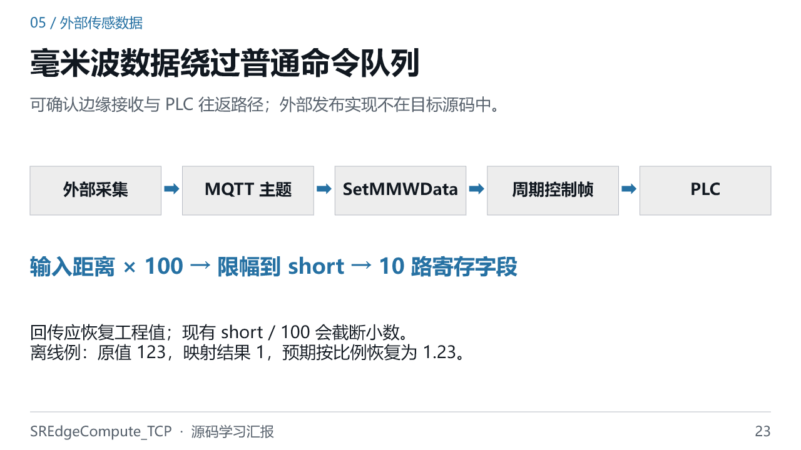

**一句话结论：** 毫米波链路的关键是比例、限幅和数据新鲜度，不能只检查消息到达。

### 可直接讲

边缘订阅毫米波主题，接收十路浮点距离后，直接调用 SetMMWData，绕过普通命令队列。每个距离乘100并限制到 short 范围，写入周期控制结构，再发送给 PLC。

从执行路径推导，这样可以避免毫米波数据等在长策略命令后面；但仍受周期发送和网络状态影响，并不是到达 MQTT 就立即被 PLC 使用。

上行反馈里发现一个具体问题：原始 short 除以整数100，先做了整数除法。123就变成1，即使之后赋给浮点字段，小数也不会回来。预期按比例恢复应是1.23。这个行为已离线复现，但实际传感器发布端和现场单位还要另外核对。

### 为什么：讲者需要理解的内容

**为什么赋给 float 也无效：** 表达式先计算，再转换到目标类型。两个整数运算先得到1，再转成1.0；改为浮点除法才有机会保留1.23，还需确认单位契约。

**限幅有什么代价：** Math.Clamp 防止超出编码范围，但饱和值可能掩盖异常测量。是否应报告无效、超量程或过期，属于需要明确的传感数据契约。

**旁路的并发影响：** 毫米波回调与普通命令可同时接触周期结构，因此共享锁仍有意义。它绕过的是普通命令排队，不是所有同步和发送步骤。

### 追问练习

**问：** 这能说明防碰撞已失效吗？

**答：** 不能。已证明的是边缘上报缩放丢失小数；PLC如何使用距离、是否另有有效位和联锁，需要 PLC 程序与现场条件确认，不能扩大结论。

**转场：** 同样要区别传输和业务含义的，还有故障清除。

**讲述提示：** 用123÷100=1说明类型规则；不自行补充未确认的“米/厘米”单位。

**依据：**

- S02 · Edge/SREdgeCompute_TCP/SREdgeCompute_TCP/App.config:1
- S05 · Edge/SREdgeCompute_TCP/SREdgeCompute_TCP/Service/CommandQueueService.cs:30
- S15 · Edge/SREdgeCompute_TCP/SREdgeCompute_TCP/Service/CommandService.cs:186
- S34 · Edge/SREdgeCompute_TCP/SREdgeCompute_TCP/Service/PlcToEdgeService.cs:494
- 隔离验证：.codex-build/sredge-20260828/probe/Probe.csproj 与 Program.cs；2026-08-28；.NET SDK 9.0.301；直接链接真实协议和 PlcToEdgeService 源码。仅配置、日志、JSON、网络依赖使用替身，不等于 net8.0 全应用测试。

## 第24页｜故障数据并入下一次状态上报

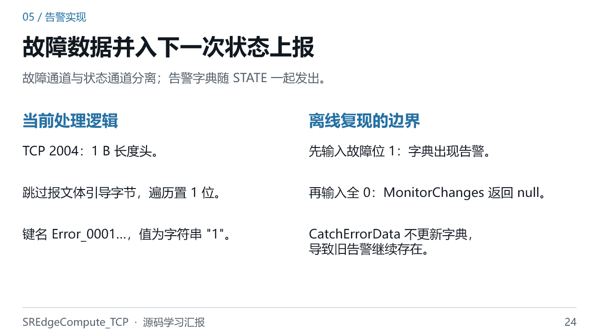

**一句话结论：** 空故障集合是一种有效状态，不能被当成“无需更新”。

### 可直接讲

故障从2004端口进入，先去掉长度头，再跳过报文体引导字节，然后扫描所有置位的故障位，组织成 Error_0001 这样的字典项。字典最终随 STATE 上报。

关键问题在全零报文。MonitorChanges 在没有任何置位时返回 null，而调用者只在结果非 null 时替换 ErrorData。于是先有一个故障、再全部恢复时，旧字典反而被保留下来。

离线验证已经复现这个过程：故障位从1变0，字典里仍有一项。这里不是 PLC 没报恢复，而是本地把“当前没有故障”和“没有更新结果”合并成了同一种返回值。后端再怎么比较新旧告警，也可能收到残留状态。

### 为什么：讲者需要理解的内容

**为什么 DetectChanges 名字误导：** 当前实现没有用 _previousData 计算差异，而是扫描当前全部置位位。它返回的更接近活动故障快照，不是真正的变化增量。

**快照与增量的差别：** 快照为空表示当前没有故障；增量为空表示没有变化。把两种契约混用，就会误删或残留状态。

**修复前应覆盖的测试：** 应检查0→1、1→0、多个故障部分清除、全部清除以及无效报文。合法全零状态与解析失败要用不同方式表示。

### 追问练习

**问：** 每次空结果都清空字典就行吗？

**答：** 只有确定它是完整、合法的全零故障快照时才应清空。若 null 还可能表示解析异常或无数据，直接清空会隐藏故障，必须先明确返回契约。

**转场：** 这些案例也提醒我们，文件和方法看起来存在，并不等于功能已经完整实现。

**讲述提示：** 先说复现顺序再解释原因；强调这是合法空集合的语义问题。

**依据：**

- S04 · Edge/SREdgeCompute_TCP/SREdgeCompute_TCP/Client/TCPClient.cs:95
- S33 · Edge/SREdgeCompute_TCP/SREdgeCompute_TCP/Service/PlcToEdgeService.cs:88
- S11 · Edge/SREdgeCompute_TCP/SREdgeCompute_TCP/Service/PlcToEdgeService.cs:34
- 隔离验证：.codex-build/sredge-20260828/probe/Probe.csproj 与 Program.cs；2026-08-28；.NET SDK 9.0.301；直接链接真实协议和 PlcToEdgeService 源码。仅配置、日志、JSON、网络依赖使用替身，不等于 net8.0 全应用测试。

## 第25页｜保留文件与未实现接口不能当作能力

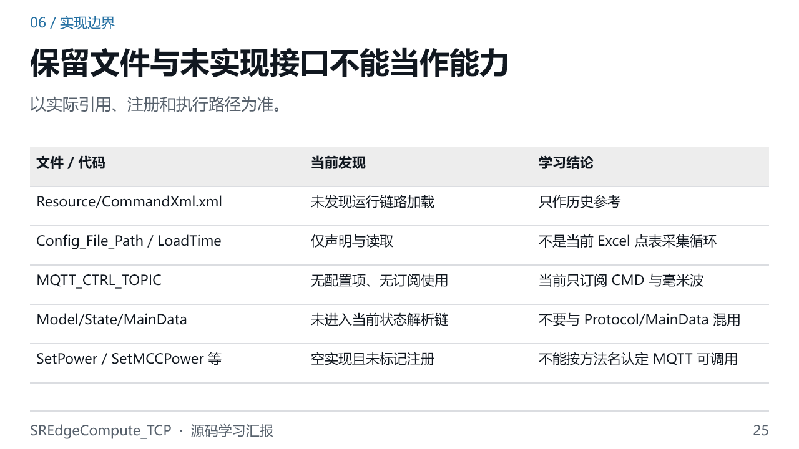

**一句话结论：** 认定功能存在，至少要找到入口、实现、调用和输出。

### 可直接讲

本页列出一些容易造成误判的代码。CommandXml 保留在资源目录，但当前命令走特性注册；LoadTime 和 Config_File_Path 被读取，却没有继续进入当前采集主链路；另一套 MainData 也没有用于当前状态解析。

有些方法名字看起来像完整能力，例如 SetPower、SetMCCPower，但它们是空实现且没有注册为当前 MQTT 命令。不能从方法名字直接推导系统已经支持这项操作。

同样，目标目录没有 Data.xlsx，也不能立即说程序因此无法运行，因为当前路径没有使用它。判断运行依赖时，应当追到实际读取或调用的位置。这样才能把历史资源、预留代码和当前实现分开。

### 为什么：讲者需要理解的内容

**四步证据：** 入口说明如何触发，实现说明做了什么，调用说明当前路径是否到达，输出说明结果如何被使用。缺少其中一环，就应保留限定。

**分析器不在现场链路：** RequireDocumentation 用于开发时规范检查；它自身也有需核对的语法节点处理风险，但不能把这个风险直接等同于 PLC 通信故障。

**未发现不等于永久不存在：** 结论限定于本次目标源码和已检索路径。外部程序集、生成代码或其他部署版本是否不同，要靠补充证据判断。

### 追问练习

**问：** 这些没用到的文件可以删掉吗？

**答：** 本任务只是学习，不授权清理代码。删除前应确认发布、构建、其他项目和历史兼容依赖，并经过测试；当前未修改业务文件。

**转场：** 接下来把已通过隔离代码运行确认的行为，和仅由阅读提出的风险分开。

**讲述提示：** 不要把“没有进入当前链路”说成“永远没用”。

**依据：**

- S01 · Edge/SREdgeCompute_TCP/SREdgeCompute_TCP/Program.cs:28
- S02 · Edge/SREdgeCompute_TCP/SREdgeCompute_TCP/App.config:1
- S05 · Edge/SREdgeCompute_TCP/SREdgeCompute_TCP/Service/CommandQueueService.cs:30
- S07 · Edge/SREdgeCompute_TCP/SREdgeCompute_TCP/Infrastructure/Commands/CommandRegistry.cs:35
- S08 · Edge/SREdgeCompute_TCP/SREdgeCompute_TCP/Service/CommandService.cs:104

## 第26页｜离线探针揭示数据与回执风险

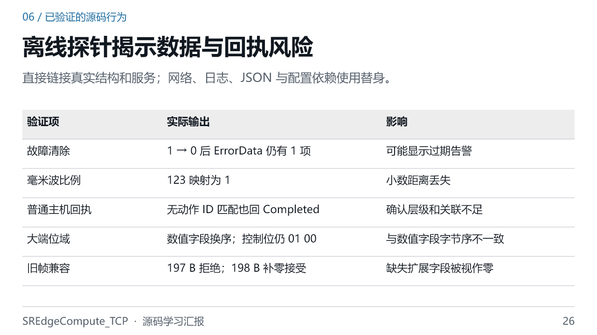

**一句话结论：** 离线探针证明特定代码条件下的行为，不等于现场故障结论。

### 可直接讲

这页五项是已经运行隔离源码得到的结果。故障全清后字典残留、毫米波123映射为1、普通主机构在缺少动作 ID 匹配时仍回 Completed，前面已经解释了原因。

另外，切换大端配置后，普通数值字段会换序，但部分控制位域仍保持宿主字节顺序；这是配置兼容风险。当前配置是小端，不能据此直接宣布现场已经发生大端问题。状态长度方面，197字节被拒绝，198字节被接受并补零，符合当前解析分支。

测试直接链接了真实协议和服务源码，网络、日志、配置和 JSON 依赖使用替身，运行于 SDK9。因此它是局部行为验证，不是原工程 net8.0 全量构建，也没有覆盖真实通信。

### 为什么：讲者需要理解的内容

**为什么链接真实源码：** 这样可以避免重新实现一遍同样逻辑后，只证明了测试替身的行为。替身仍会缩小覆盖范围，所以需要公开哪些依赖被替换。

**位域为什么容易漏换序：** 标量属性经过 Utility，而直接对 ushort 位运算的路径可能绕过转换。数值字段测对，不代表同一结构内每个字段都测对。

**补零的语义代价：** 短帧兼容使解析继续工作，但新字段的0可能意味着“缺失”，而非真实测量为0。业务是否需要版本或有效性标志，应单独明确。

### 追问练习

**问：** 这些验证结果可以直接写成缺陷单吗？

**答：** 可以形成有条件、可复现的源码问题记录，附输入、输出和测试环境；影响等级与现场复现情况应另列，不能自动升级为已确认生产故障。

**转场：** 下一页则是需要补充运行条件才能确认影响程度的风险。

**讲述提示：** 逐条说明“测到了什么”，最后统一交代没测到什么。

**依据：**

- 隔离验证：.codex-build/sredge-20260828/probe/Probe.csproj 与 Program.cs；2026-08-28；.NET SDK 9.0.301；直接链接真实协议和 PlcToEdgeService 源码。仅配置、日志、JSON、网络依赖使用替身，不等于 net8.0 全应用测试。
- S12 · Edge/SREdgeCompute_TCP/SREdgeCompute_TCP/Service/PlcToEdgeService.cs:632
- S16 · Edge/SREdgeCompute_TCP/SREdgeCompute_TCP/Protocol/MainData.cs:1027
- S18 · Edge/SREdgeCompute_TCP/SREdgeCompute_TCP/Protocol/RealTimeControl.cs:15
- S33 · Edge/SREdgeCompute_TCP/SREdgeCompute_TCP/Service/PlcToEdgeService.cs:88
- S34 · Edge/SREdgeCompute_TCP/SREdgeCompute_TCP/Service/PlcToEdgeService.cs:494

## 第27页｜运行期可靠性仍需台架验证

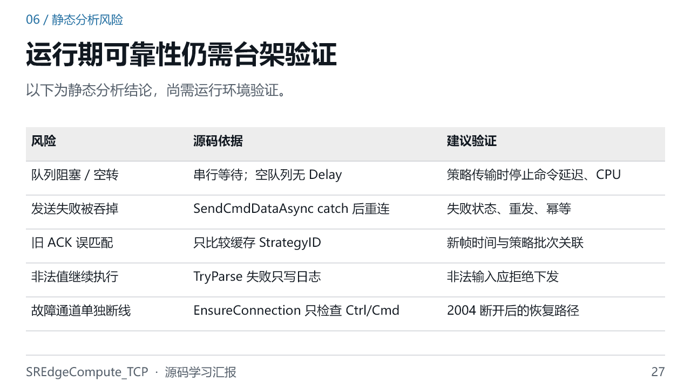

**一句话结论：** 静态风险要转成具体失败场景，才能验证影响和改进效果。

### 可直接讲

这页列的是运行期可靠性检查点。串行策略等待会阻塞后续队列，空队列又没有等待机制；命令 TCP 发送异常被捕获后不向调用方返回明确失败；策略只比缓存段号，可能接受旧确认。

另外，走行参数解析失败后继续执行，以及故障通道单独断线后的恢复路径，都需要单独设计测试。EnsureConnection 的快捷判断只检查控制和命令通道，因此不能用这两个通道正常来代替故障通道健康。

这些结论来自具体分支，但影响多大需要条件和测量。例如停止命令到底延迟多久、CPU是否显著升高、断线后是否恢复，都应在隔离台架记录，不能凭代码阅读给出现场数字。

### 为什么：讲者需要理解的内容

**await 为什么没捕获到失败：** 如果被调用方法内部吞掉异常，外层 await 得到的是正常结束；外层 catch 不会自动知道网络操作失败。需要有明确错误传播契约。

**旧 ACK 的时间线：** 假设缓存段号已为1，新一次数据发送失败，而等待只查“是否等于1”，便可能满足条件。该假设用于设计台架用例，不是声称已经抓到现场复现。

**如何验证队列延迟：** 给每条命令记录接收、入队、出队、发送和反馈时间，分离排队耗时、网络耗时和设备耗时；不能只记录最终总时长。

### 追问练习

**问：** 应该先修哪一个？

**答：** 建议先补齐输入拒绝、回执关联和发送失败可见性等影响控制判断的证据，同时修复已复现的数据问题；排序还需结合现场严重度与安全责任人评估。

**转场：** 代码改进之外，部署和现场控制边界也必须独立核对。

**讲述提示：** 用“待验证风险”措辞，不讲未经测量的概率、时延或事故结论。

**依据：**

- S06 · Edge/SREdgeCompute_TCP/SREdgeCompute_TCP/Service/CommandQueueBackgroundService.cs:15
- S04 · Edge/SREdgeCompute_TCP/SREdgeCompute_TCP/Client/TCPClient.cs:95
- S09 · Edge/SREdgeCompute_TCP/SREdgeCompute_TCP/Service/CommandService.cs:2895
- S13 · Edge/SREdgeCompute_TCP/SREdgeCompute_TCP/Service/CommandService.cs:3451
- S14 · Edge/SREdgeCompute_TCP/SREdgeCompute_TCP/Service/CommandService.cs:4760

## 第28页｜安全、配置与部署必须单独验收

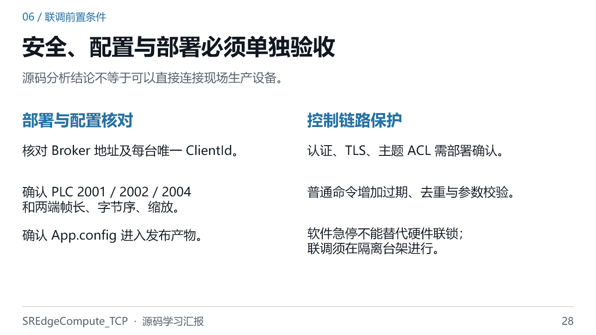

**一句话结论：** 配置正确、访问受控和设备安全，是源码之外必须补齐的验收条件。

### 可直接讲

首先核对地址。127.0.0.1 表示当前进程所在机器；后端和边缘如果不在同一台机器，不能照抄成“同一个 Broker”。其次核对连接身份，同一个 Broker 上的不同活动客户端应避免复用 ClientId。

PLC 侧要核对三个端口、帧长、字节序和缩放，还要确认实际发布目录带上正确配置。存在发布配置文件，只说明项目有一种发布设置，不能证明现场运行的就是本次源码版本。

控制链路保护也要单独验收，包括认证、TLS、主题权限和网络分区。源码未配置这些，不足以判断现场完全没有保护；但也不能因此默认已具备。软件停止依赖普通软件链路，不能当作硬件安全联锁的替代品。

### 为什么：讲者需要理解的内容

**地址为什么常出错：** localhost 是相对执行主机的地址。必须把“哪个进程在哪台机器上、它连接哪个地址”写成部署表，不能只比较配置字符串。

**主题不是权限：** 主题路径有设备号只提供路由约定，能否越权发布取决于 Broker 的身份验证与授权。当前仓库不足以证明现场 ACL。

**版本验证：** 建议把可执行文件版本、配置、源码指纹和 PLC 协议版本一起存档。只有对应起来，源码分析才可用于解释特定部署。

### 追问练习

**问：** 现在能把示例连接到生产环境试一下吗？

**答：** 不应直接这样做。本次产物是学习材料，不是上线授权；需隔离台架、确认的协议与配置、操作许可及安全验证流程。

**转场：** 下一页给出补齐证据的顺序，先从不驱动真实机构的验证开始。

**讲述提示：** 这是验收边界，不是安全认证结论；不展示现场操作指令。

**依据：**

- S02 · Edge/SREdgeCompute_TCP/SREdgeCompute_TCP/App.config:1
- S03 · Edge/SREdgeCompute_TCP/SREdgeCompute_TCP/Client/MqttClient.cs:29
- S04 · Edge/SREdgeCompute_TCP/SREdgeCompute_TCP/Client/TCPClient.cs:95
- S37 · Edge/SREdgeCompute_TCP/SREdgeCompute_TCP/Service/CommandService.cs:357
- S38 · Edge/SREdgeCompute_TCP/SREdgeCompute_TCP/SREdgeCompute_TCP.csproj:1

## 第29页｜下一步用隔离台架补齐完整证据

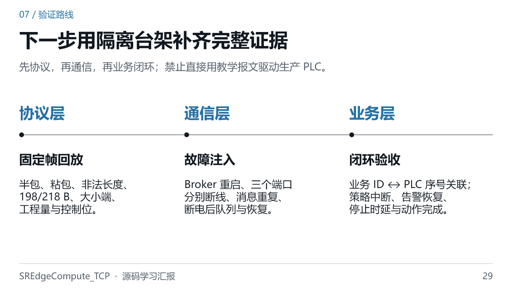

**一句话结论：** 按协议、通信、业务闭环分层验证，才能知道失败发生在哪一层。

### 可直接讲

下一阶段建议分三层做隔离台架。协议层先验证固定帧：正确帧、半包、粘包、非法长度、大小端、工程量缩放和控制位。这里不需要驱动真实机构。

通信层再加入独立 Broker 和 PLC 模拟器，分别制造断线、重连、单通道故障、重复和过期消息。最后验证业务闭环：从 HTTP 请求生成业务 ID，到 PLC 模拟反馈，再到 RETURN、数据库和界面。

每个用例都要预先写清输入、预期结果和判定标准。尤其失败流不能只看有没有弹出成功，应记录命令是否被拒绝、是否重复发送、已确认到哪一段，以及旧状态有没有被误当成新结果。

### 为什么：讲者需要理解的内容

**为什么按这个顺序：** 如果编码本身不正确，直接跑全链路会同时引入网络、业务与展示变量，定位困难。先把底层输入输出固定，再逐层加入真实依赖。

**哪些结果算通过：** 例如非法值应明确拒绝且不生成控制帧；合法故障全零应清空活动集合；过期 ACK 不应完成新批次。这里是建议的验收目标，不是现有代码均已满足。

**为什么需要失败流：** 正常情况下各阶段都顺利，很难暴露关联缺失和异常吞掉。丢包、断线及重复请求可检验“成功”的证据是否充分。

### 追问练习

**问：** 模拟器通过以后是不是就可以上线？

**答：** 还不够。模拟器要与确认协议一致，之后仍需受控的 PLC/设备集成验证、部署验收和相应安全审批；模拟通过不能替代真实联锁验证。

**转场：** 下面用学习检查点把整套内容收束，确认能复述而不只是看懂。

**讲述提示：** 讲方法，不承诺本阶段已经执行这些新增台架测试。

**依据：**

- S04 · Edge/SREdgeCompute_TCP/SREdgeCompute_TCP/Client/TCPClient.cs:95
- S06 · Edge/SREdgeCompute_TCP/SREdgeCompute_TCP/Service/CommandQueueBackgroundService.cs:15
- S12 · Edge/SREdgeCompute_TCP/SREdgeCompute_TCP/Service/PlcToEdgeService.cs:632
- S13 · Edge/SREdgeCompute_TCP/SREdgeCompute_TCP/Service/CommandService.cs:3451
- S14 · Edge/SREdgeCompute_TCP/SREdgeCompute_TCP/Service/CommandService.cs:4760
- 隔离验证：.codex-build/sredge-20260828/probe/Probe.csproj 与 Program.cs；2026-08-28；.NET SDK 9.0.301；直接链接真实协议和 PlcToEdgeService 源码。仅配置、日志、JSON、网络依赖使用替身，不等于 net8.0 全应用测试。

## 第30页｜源码学习可以按七个检查点复述

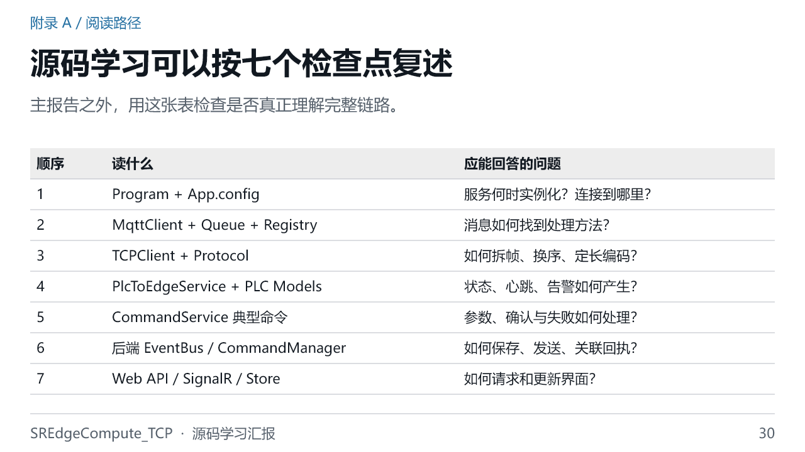

**一句话结论：** 真正理解源码，应能解释一条命令和一条状态的完整生命周期。

### 可直接讲

学习验收不能只问类名记住没有。我会用几个检查点自测：入口如何启动；MQTT收什么发什么；队列怎样消费；命令如何注册；参数怎样变成 PLC 字段；状态怎样返回；每类确认和超时说明什么。

建议先反复讲清三个样例：走行目标、自动堆料策略、自动取料策略。走行覆盖普通动作链路，堆料覆盖多段传输，取料则帮助比较不同策略的确认方式。之后再按分组扩展其他命令。

如果能从一个 Cmd 找到处理方法、输入格式、输出帧和回执条件，并指出还缺哪项证据，就算建立了可用的源码理解。完整文件和命令清单可以查，不必把135个名字都背下来。

### 为什么：讲者需要理解的内容

**为什么选这三个样例：** 它们代表不同控制路径，能暴露共享周期数据、即时帧和策略确认之间的差别；同一套问题可迁移到其他命令。

**复述比背诵更有效：** 把变量值从输入一路追到输出，必须面对缩放、类型和条件分支；只背方法名可能绕过这些关键细节。

**七个检查点：** 入口与生命周期；MQTT主题与负载；队列和并发；命令注册与分发；PLC编码；状态映射与上报；回执、心跳和异常边界。

### 追问练习

**问：** 怎样判断自己能独立排查？

**答：** 给自己一个“HTTP成功但没有动作”或“状态能收到但值不对”的场景，能说出分段证据和下一步检查点，且不先盲目重发，就比只会查日志更接近目标。

**转场：** 接下来是附录：报文、命令清单和来源，可在技术追问时展开。

**讲述提示：** 可将30—33页作为附录简讲，最后跳到34页总结。

**依据：**

- S01 · Edge/SREdgeCompute_TCP/SREdgeCompute_TCP/Program.cs:28
- S03 · Edge/SREdgeCompute_TCP/SREdgeCompute_TCP/Client/MqttClient.cs:29
- S04 · Edge/SREdgeCompute_TCP/SREdgeCompute_TCP/Client/TCPClient.cs:95
- S08 · Edge/SREdgeCompute_TCP/SREdgeCompute_TCP/Service/CommandService.cs:104
- S11 · Edge/SREdgeCompute_TCP/SREdgeCompute_TCP/Service/PlcToEdgeService.cs:34
- S22 · SRIntelligentSystem/SRIntelligentSystem.Application.Dispatch/Manager/CommandManager.cs:53
- S23 · SRIntelligentSystem/Plugins/Dhhi.Net.EventBus/MqttEventSourceStorer.cs:23
- S28 · Web/src/api/main/manualStackAction.ts:1
- S29 · Web/src/stores/signalR/allData.ts:72

## 第31页｜业务报文使用 JSON，PLC 使用字节帧

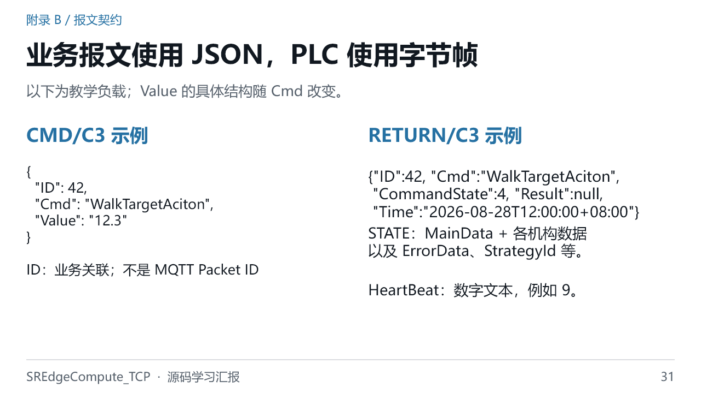

**一句话结论：** 外层 JSON 的 Value 类型，与里面承载的策略结构是两层契约。

### 可直接讲

这页展示教学报文，不是现场抓包。普通走行命令的外层包含 ID、Cmd 和 Value，Value 在该路径里通常是数字字符串，原因是后端命令入口接收 string，然后整体序列化。

策略命令要再多理解一层：AutoStack 或 AutoPick 先序列化成 JSON 字符串，作为外层 Value；边缘读取外层后，再按该命令解析里面的策略。直接把它改成任意对象，不一定符合当前调用契约。

RETURN 的 CommandState 默认是数字枚举，例如4代表 Completed，但仍要回到触发条件解释。Time 和 LifeCycle 等字段在部分路径没有统一赋值，也不能看到字段存在就认定里面一定有有效业务信息。

### 为什么：讲者需要理解的内容

**为什么出现转义：** 当内层 JSON 作为字符串放入外层 JSON，内部双引号需要转义。解析外层后得到的仍是字符串，还需按具体 Cmd 处理。

**格式正确不等于业务正确：** JSON 能反序列化，只说明语法和部分类型可接受；数组长度、数值范围、单位、模式以及命令时效还要校验。

**展示的边界：** ID=42 是示例，不是数据库现存命令。报文只用于理解字段关系，不应直接复制到生产主题发布。

### 追问练习

**问：** 能把 Value 全部改成强类型对象吗？

**答：** 可以作为接口演进方向评估，但会影响后端、边缘和调用端兼容性；需要版本化契约与测试，不能只改一侧模型。

**转场：** 报文格式清楚后，再看命令清单应该怎样使用。

**讲述提示：** 如果主报告时间紧，本页留作追问；不要逐字符读JSON。

**依据：**

- S05 · Edge/SREdgeCompute_TCP/SREdgeCompute_TCP/Service/CommandQueueService.cs:30
- S09 · Edge/SREdgeCompute_TCP/SREdgeCompute_TCP/Service/CommandService.cs:2895
- S13 · Edge/SREdgeCompute_TCP/SREdgeCompute_TCP/Service/CommandService.cs:3451
- S35 · Edge/SREdgeCompute_TCP/SREdgeCompute_TCP/Model/Command/ReturnCommandModel.cs:19

## 第32页｜命令覆盖分布集中在堆取料与机构控制

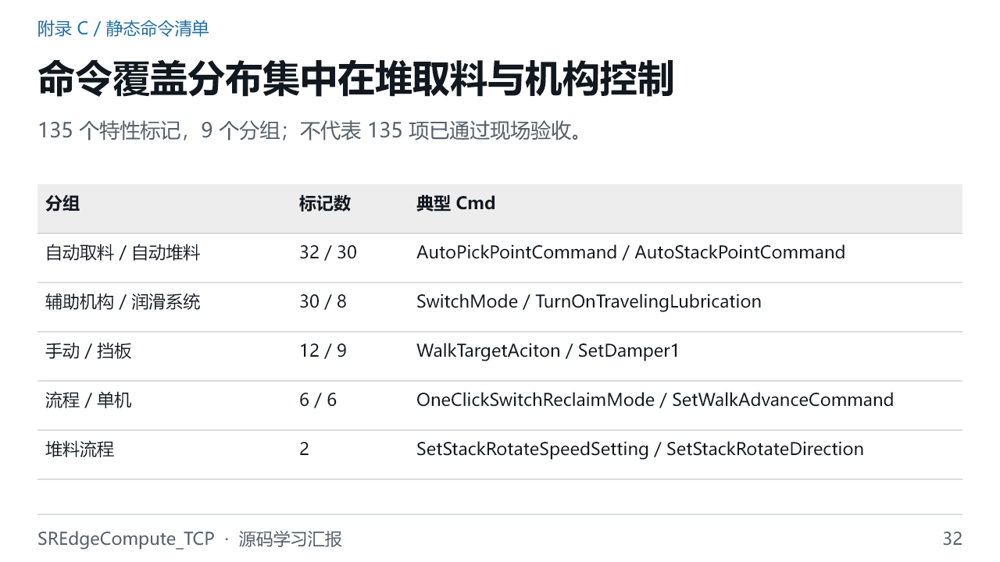

**一句话结论：** 135是静态命令标记数量，不是功能验收数量。

### 可直接讲

命令按九个分组统计。自动取料32个、自动堆料30个、辅助机构30个，手动12个、挡板9个、润滑8个，流程和单机各6个，堆料流程2个，总计135个静态标记。

这张表的价值是帮助安排阅读：命令分布主要集中在堆取料参数、流程和机构控制。典型 Cmd 名称必须按源码使用，例如 SetDamper1，以及保留 Aciton 拼写的走行目标命令。

但存在标记、成功注册、具备有效实现、现场验收通过，是不同层次。本次清单可以作为查找入口，不能把135直接写成“已完成135项现场功能验证”。新增或改动命令时，也要更新契约和测试，而不只增加一行统计。

### 为什么：讲者需要理解的内容

**统计为什么这样做：** 当前按有效行首 Command 特性提取，保留名称、分组、方法和行号；本次未发现重复名称。运行时仍有签名、Enabled 和冲突选择检查。

**覆盖数量的局限：** 多个参数命令可能只是写同一结构的不同字段，一个策略命令则包含复杂传输。命令数不能直接比较实现难度或测试充分性。

**怎样用清单：** 以 Cmd 检索方法，沿 Value 解析、参数映射、发送与回执逐项建立证据；必要时再查看被调用辅助方法。

### 追问练习

**问：** 分组会影响执行优先级吗？

**答：** 当前分组用于元信息与查询，不改变普通队列执行顺序。分组名、Priority 和设备执行优先级都不能混用。

**转场：** 所有这些数字和结论，最后都要能返回源文件核对。

**讲述提示：** 可只讲“总计135、九组、非验收数”，具体分布供追问。

**依据：**

- S07 · Edge/SREdgeCompute_TCP/SREdgeCompute_TCP/Infrastructure/Commands/CommandRegistry.cs:35
- S08 · Edge/SREdgeCompute_TCP/SREdgeCompute_TCP/Service/CommandService.cs:104

## 第33页｜结论均可回到源码与验证记录

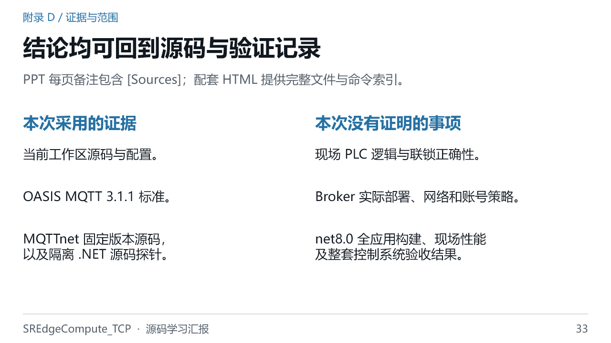

**一句话结论：** 把来源、版本和验证条件带上，结论才可复核。

### 可直接讲

本次每页 PPT 备注都包含来源，配套学习文档提供完整文件、命令索引和源码指纹。基础协议依据 OASIS MQTT 3.1.1，库默认值则按项目引用的 MQTTnet 具体版本核对。

项目行为以当前源码为准，没有直接照用介绍其他边缘工程的接手说明。也没有把未核对的在线协议表当作现场协议结论。源码快照没有可用提交号，所以采用 SHA-256 标识这次阅读的文件版本。

复核时最重要的是四件事：结论对应哪段代码；输入和输出是什么；在哪个环境验证；有哪些尚未覆盖。后续源码或部署改变以后，应重新确认相关结论，不能长期沿用旧页码和旧测试结果。

### 为什么：讲者需要理解的内容

**为什么要保存指纹：** 行号可能变化，文件哈希能帮助判断是否仍是同一份内容。哈希能标识版本差异，但不能证明源码正确或部署可信。

**来源优先级：** 当前运行路径和实际字段优先于过时注释；固定版本库源码用于默认值；隔离测试用于局部行为；现场结论还需要部署和设备证据。

**复核方式：** 讲稿每页保留对应 PPT 标题、来源编号和文件行号。源码链接只适合本机环境，跨机器分享时应连同受控源码快照或审阅材料提供。

### 追问练习

**问：** 为什么不直接引用现有接手文档？

**答：** 它涉及 ConsoleEdge 等其他工程，不能自动作为 SREdgeCompute_TCP 当前行为的依据。可用于背景，但关键结论要回到本目标调用链。

**转场：** 最后用三句话总结本阶段学到了什么，以及下一步缺什么。

**讲述提示：** 强调“可复核”，不把文件哈希说成安全认证。

**依据：**

- S38 · Edge/SREdgeCompute_TCP/SREdgeCompute_TCP/SREdgeCompute_TCP.csproj:1
- [OASIS MQTT 3.1.1 标准 §3.1–3.3、§3.8、§4.3、§4.7](https://docs.oasis-open.org/mqtt/mqtt/v3.1.1/os/mqtt-v3.1.1-os.html)
- [MQTTnet v4.3.6.1152 ManagedMqttClientExtensions.cs](https://raw.githubusercontent.com/dotnet/MQTTnet/v4.3.6.1152/Source/MQTTnet.Extensions.ManagedClient/ManagedMqttClientExtensions.cs)
- [MQTTnet v4.3.6.1152 MqttClientOptions.cs](https://raw.githubusercontent.com/dotnet/MQTTnet/v4.3.6.1152/Source/MQTTnet/Client/Options/MqttClientOptions.cs)
- 隔离验证：.codex-build/sredge-20260828/probe/Probe.csproj 与 Program.cs；2026-08-28；.NET SDK 9.0.301；直接链接真实协议和 PlcToEdgeService 源码。仅配置、日志、JSON、网络依赖使用替身，不等于 net8.0 全应用测试。

## 第34页｜已建立可追踪的边缘侧源码模型

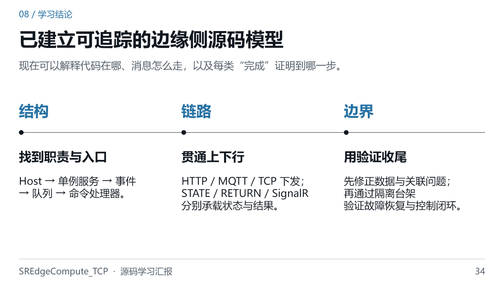

**一句话结论：** 已经能解释结构、链路和确认边界；下一步是隔离台架补齐运行证据。

### 可直接讲

本阶段形成了三个结论。第一，SREdgeCompute_TCP 的核心是把业务命令和 PLC 字节协议连接起来，完成参数映射、传输编排和状态转换。第二，下行、状态上行、业务回执和心跳是相互关联但语义不同的链路。

第三，源码里的 Completed 不能统一解释成机械到位。理解系统不仅要知道哪段代码在执行，还要知道它依据什么条件判断成功，以及这个条件没有覆盖什么。

目前已完成结构和调用链梳理，并验证了若干数据与回执行为。下一步应围绕参数校验、故障清除、缩放、回执关联、断线恢复和队列时延做隔离台架闭环。汇报到这里，后面的讨论可以沿具体 Cmd、状态字段或失败场景继续展开。

### 为什么：讲者需要理解的内容

**为什么这样收束：** 用系统职责、通信链路和确认边界三个结论对应最初学习目标，避免最后只留下一串缺陷清单。

**工程改进的边界：** 讲稿中的改进方向未修改源码；应在需求、现场协议、安全责任和回归测试约束下实施，而不是边学习边直接改生产行为。

**最终自测：** 合上讲稿，能独立说明 WalkTargetAciton 从 Value 到18字节再到 RETURN 的过程，并说出至少两个不能据此证明动作完成的原因。

### 追问练习

**问：** 一句话说明这次学习的价值？

**答：** 现在能把界面上的一次操作追到具体协议字段，也能把“成功”拆成可检查的条件，从而更准确地联调、评审和定位问题。

**转场：** 结束语：谢谢，欢迎针对具体链路、确认语义或验证方案提问。

**讲述提示：** 三条结论逐条停顿；以“补齐证据”结束，不以“已经可上线”结束。

**依据：**

- S01 · Edge/SREdgeCompute_TCP/SREdgeCompute_TCP/Program.cs:28
- S08 · Edge/SREdgeCompute_TCP/SREdgeCompute_TCP/Service/CommandService.cs:104
- S12 · Edge/SREdgeCompute_TCP/SREdgeCompute_TCP/Service/PlcToEdgeService.cs:632
- S24 · SRIntelligentSystem/SRIntelligentSystem.Application.Dispatch/Subscriber/MqttEventSubscriber.cs:51
- S25 · SRIntelligentSystem/SRIntelligentSystem.Application.Dispatch/Subscriber/MqttEventSubscriber.cs:251
- 隔离验证：.codex-build/sredge-20260828/probe/Probe.csproj 与 Program.cs；2026-08-28；.NET SDK 9.0.301；直接链接真实协议和 PlcToEdgeService 源码。仅配置、日志、JSON、网络依赖使用替身，不等于 net8.0 全应用测试。

## 汇报前速查：十句话不要讲过头

|容易说过头|准确说法|对应PPT|
|---|---|---|
|“接口成功，设备就执行完成了。”|“接口已受理/下发；还需分别确认边缘处理、PLC反馈和机构完成。”|12、14、15|
|“QoS 2 保证机械动作只执行一次。”|“QoS约束相应消息交付；业务重试与PLC执行需要独立的关联和幂等设计。”|9|
|“Completed 就是机械到位。”|“当前各命令的 Completed 触发条件不同，需逐类说明。”|15|
|“每500毫秒必定发一帧，1秒脉冲必定发两次。”|“发送后延迟500毫秒；网络、重试和调度会改变实际节奏。”|6、19|
|“Priority 能让停止命令插队。”|“Priority 只解决同名注册冲突，普通队列仍串行消费。”|6、20、27|
|“心跳正常就能安全作业，失联后会自动急停。”|“当前心跳和清理逻辑不能证明现场联锁或急停策略。”|16、28|
|“堆料和取料数据都重发3次。”|“堆料各段最多尝试3次；取料零帧最多3次，数据帧发1次。”|21、22|
|“已经支持并验收了135项控制功能。”|“当前提取到135个静态命令标记，运行注册与现场验收需另查。”|20、32|
|“源码没有TLS，所以现场完全没有安全保护。”|“本包装代码未配置；Broker权限、网络隔离和部署保护仍待核对。”|10、28|
|“离线探针通过，整个系统就验证完了。”|“探针只覆盖特定源码行为，未覆盖原工程全量运行与现场PLC。”|26、29、33|

## 六种标识与信号

|名称|例子|用途|不能混淆的点|
|---|---|---|---|
|设备编码|C3|选设备、拼接主题及SignalR事件名|不是连接身份，也不是一次请求编号。|
|MQTT ClientId|C3 / EdgeC3|标识Broker上的客户端连接|同名字符串不代表同一个业务角色。|
|业务 ID|long；教学值42|关联数据库命令、RETURN与前端请求|不会原样写入本例18字节动作帧。|
|PLC动作序号|byte计数回绕，写入short字段|动作协议中的短序号|当前普通回执未做完整动作ID对应检查。|
|策略段号|堆料0→1…7；取料0→1|策略传输步骤确认|缓存相等不代表本批次新确认。|
|周期/状态VerifyID|周期递增或PLC反馈值|观察持续收发的信号|不能独立证明设备可运行或动作完成。|

## 四个追问场景

|场景|回答顺序|提醒|
|---|---|---|
|HTTP成功，机构不动作|查普通接口是否等待回执 → 业务ID与数据库 → CMD投递 → 边缘入队/出队 → 注册与参数 → TCP2002输出 → PLC模式与反馈。|先界定“成功”层级；不要先盲目补发控制命令。|
|状态到达但数值不对|核对原始字节 → 字段位置与字节序 → 类型与比例 → AllData值 → 后端与前端展示。|用同一帧追踪转换，排除mock与过期数据。|
|故障发生能显示，恢复不消失|核对合法全零故障体 → MonitorChanges返回值 → ErrorData替换条件 → 下一帧STATE → 后端新旧告警比较。|区分快照为空与没有变化，不能把解析失败也当恢复。|
|策略很快返回成功但新数据未生效|记录发送前缓存段号 → 本轮批次和发送时间 → 新反馈时间及段号 → 所有段的数据与状态。|旧缓存命中只是风险假设，需台架构造并保存证据。|

## 最后一轮自测

1. 不看稿画出五方链路，并标出协议。
2. 解释HTTP成功、MQTT交付、RETURN Completed和机械到位的区别。
3. 用12.3解释缩放、short、小端序，区分业务ID42与动作ID0。
4. 说清堆料七段、取料五层的帧长、段号与尝试次数。
5. 解释合法空故障集合与没有更新的区别。
6. 区分离线复现行为与待台架验证风险。

每题先用30秒讲结论，再用1分钟讲原因、证据和边界。

原PPT SHA-256：f2ebcc2c548b097951725b17c1af671e4538609100ba07c2ca129800388c5e03
